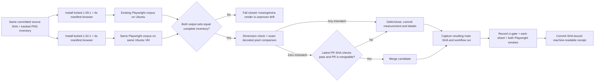

# Phase 244: `@playwright/test` 1.59.1 → 1.62.1, Alone - Research

**Researched:** 2026-09-26 UTC  
**Domain:** Playwright dependency/browser upgrade, deterministic screenshot comparison, GitHub Actions evidence  
**Confidence:** HIGH for repository structure, official browser manifests, and sampled live GitHub state; MEDIUM for comparator implementation details until exercised in Ubuntu CI

<user_constraints>
## User Constraints (from CONTEXT.md)

### Locked Decisions

#### Visual drift proof
- **D-01:** Measure the old and candidate Playwright versions on the same source revision and CI-native Ubuntu environment. Render the complete inventory of committed Playwright PNGs (expected about 115) for both versions and compare exact pixels. Missing images, dimension changes, or any differing pixel count as drift. Do not use Playwright's configurable visual-comparison tolerance as proof of exact zero.
- **D-02:** Do not update or commit PNG baselines as part of the measurement. Preserve the result in a committed machine-readable manifest regardless of the merge decision. Record source SHA, run ID, package versions, Chromium revisions, inventory, and per-image result; retain rendered images and diffs as run artifacts for inspection.

#### Browser provenance and cache behavior
- **D-03:** Record the Chromium revision from each version's tagged Playwright browser manifest; do not hand-maintain revision values. Re-read the tagged manifests when executing because package-to-browser mappings can change over time.
- **D-04:** Keep the existing CI cache strategy in this phase. Update the applicable versioned cache keys for 1.62.1 and re-check that the guard validates each Playwright cache-key variant. Do not replace the cache with a lockfile-wide hash, redesign the cache mechanism, or remove caching in the same change; evaluate cache economics separately if warranted.
- **D-05:** Preserve the repository's existing CI boot and test-data isolation seams. This is an npm test-tooling update consumed by the Phoenix example and generated-host workflows, not a change to Sigra's Elixir/Plug/Ecto/Phoenix runtime contract.

#### Merge or defer
- **D-06:** Merge PR #213 only if the exact-pixel comparison reports zero drift and required checks pass for the latest PR SHA. Otherwise close/defer it with the measurement and actionable failure details attached. Never open a recapture lane for this phase.
- **D-07:** Refresh the PR against current `main` and diagnose any existing failed checks before making the merge decision. The August 8, 2026 run observed during discussion was failing and the PR was conflicted; this stale run establishes neither zero nor nonzero visual drift and must not substitute for new evidence.

#### Final `main` verification
- **D-08:** After either merge or deferral, capture the exact resulting `main` SHA and run ID and verify successful execution of `ci-gate`, every `example_playwright_shard` matrix job, `example_playwright_smoke`, and `generated_admin_playwright_smoke`. A skipped job or green aggregate alone does not prove that each named consumer ran successfully.
- **D-09:** Preserve a committed machine-readable receipt that maps each required consumer to its exact-SHA job conclusion. Keep the aggregate gate result and individual consumer results distinct so the evidence states exactly what ran.

### the agent's Discretion
- Choose the focused CI job/script structure, machine-readable manifest schema, and artifact layout that reuse existing repository conventions while proving the decisions above. Keep logs and the committed receipt understandable to a maintainer who only needs to decide merge versus defer.
- Reconfirm live PR state, required check names, cache-key variants, and browser manifest revisions at execution time; those external/current values may change after this context was gathered.

### Deferred Ideas (OUT OF SCOPE)
- `.planning/todos/pending/2026-06-20-playwright-parallelization-per-shard-db.md` concerns CI speed and per-shard database/app isolation. It remains outside this version-bump-only phase.
- Any ongoing hosted visual-review service or browser-cache redesign should be evaluated separately from this isolated dependency bump.
</user_constraints>

<phase_requirements>
## Phase Requirements

| ID | Description | Research Support |
|----|-------------|------------------|
| QUEUE-02 | `@playwright/test` (#213) is handled **alone and last**; merged only if CI-native baseline drift measures zero across the ~115 committed PNGs, otherwise deferred to a todo with browser revisions recorded pre/post. No recapture lane is opened in this milestone. `[VERIFIED: .planning/REQUIREMENTS.md:98-103]` Quote: `"QUEUE-02"`, `"#213"`, `"~115"`, `"No recapture lane is opened in this milestone."` | Exact-image measurement, browser manifest provenance, evidence receipt, conditional PR disposition, and exact-SHA main checks below. |
</phase_requirements>

## Summary

Keep this as an isolated npm test-tooling and CI evidence phase. The repo lock currently resolves `@playwright/test`, `playwright`, and `playwright-core` to `"1.59.1"`; each installed Playwright release is coupled to specific browser binaries, so the locked versions must be installed and rendered separately on one Ubuntu runner, with package/browser caches isolated per version. `[VERIFIED: test/example/priv/playwright/package-lock.json:121-135,566-596]` Quote: `"version": "1.59.1"`, `"playwright": "1.59.1"`, `"playwright-core": "1.59.1"`. `[CITED: https://playwright.dev/docs/browsers]`

The tagged manifests currently give Chromium revision `1217` / browser `147.0.7727.15` for 1.59.1 and revision `1234` / browser `151.0.7922.34` for 1.62.1. Re-read each tagged manifest in the measuring workflow and record the values it reads; do not encode revisions as a hand-maintained source of truth. `[CITED: https://raw.githubusercontent.com/microsoft/playwright/v1.59.1/packages/playwright-core/browsers.json; https://raw.githubusercontent.com/microsoft/playwright/v1.62.1/packages/playwright-core/browsers.json]`

**Primary recommendation:** Build a focused Ubuntu CI measurement that renders both exact lock states from one source SHA, proves its per-version output inventory is identical to the 115 tracked Playwright PNG paths, compares decoded pixels at zero tolerance, and emits a committed JSON decision receipt plus uploaded render/diff artifacts. Any missing output, changed dimensions, nonzero changed pixels, missing check, stale SHA, or ambiguous PR state is a nonzero/unproven outcome and cannot authorize merge. `[VERIFIED: .planning/phases/244-playwright-test-1-59-1-1-62-1-alone/244-CONTEXT.md:10-34]` Quote: `"Missing images, dimension changes, or any differing pixel count as drift."`

## Architectural Responsibility Map

| Capability | Primary Tier | Secondary Tier | Rationale |
|------------|-------------|----------------|-----------|
| Render committed screenshot corpus | Browser / Client | Frontend Server (SSR) | Playwright drives Chromium against the existing Phoenix example and generated host. The application server/database are fixtures for the browser run. `[VERIFIED: .github/workflows/ci.yml:1190-1235,1417-1471]` Quote: `"example_playwright_shard"`, `"browsers: chromium"`, `"browsers: chromium webkit"`, `"generated_admin_playwright_smoke"`. |
| Compare outputs and decide drift | CI / automation | — | Runner script owns inventory equality, dimensions, pixel counts, decision, and diagnostic JSON; do not let screenshot assertion tolerance make the merge decision. `[CITED: https://playwright.dev/docs/test-snapshots; https://imagemagick.org/compare/]` |
| Record PR and main evidence | GitHub Actions / CI | GitHub API | Workflow run and each required job need the exact commit SHA, run ID, matrix identity, and conclusion. The aggregate `ci-gate` is a separate signal. `[VERIFIED: .github/workflows/ci.yml:1389-1415,1550-1574]` Quote: `"example_playwright_smoke"`, `"generated_admin_playwright_smoke"`, `"ci-gate"`. `[CITED: https://docs.github.com/en/rest/guides/using-the-rest-api-to-interact-with-checks]` |

## Standard Stack

### Core

| Library / tool | Version | Purpose | Why Standard |
|---------|---------|---------|--------------|
| `@playwright/test` | baseline `1.59.1`; candidate `1.62.1` | Existing TypeScript browser test runner and screenshot capture. | Locked decision and existing repo dependency. npm registry queries returned both requested versions; the package legitimacy seam returned `SUS` (`too-new`), so retain it only with the audit warning below. `[CITED: https://registry.npmjs.org/@playwright/test; https://github.com/microsoft/playwright/releases/tag/v1.62.1]` |
| Playwright-bundled Chromium | revision `1217` for 1.59.1; `1234` for 1.62.1 (current tagged manifests) | Browser binary paired with each package build. | Manifest is the package's authoritative revision map; `npx playwright install` obtains the matching browser. Re-read at execution. `[CITED: https://playwright.dev/docs/browsers; tagged manifest URLs above]` |
| GitHub-hosted Ubuntu Actions runner | `ubuntu-latest` (repo convention) | Identical OS family for both rendering passes and existing test workflows. | Existing shard and generated-host jobs use this runner. Execute both versions sequentially in the same job/VM so host image, system fonts, and installed dependencies are shared. `[VERIFIED: .github/workflows/ci.yml:1190-1193,1417-1425]` Quote: `"runs-on: ubuntu-latest"`. |
| Exact pixel comparator | ImageMagick `compare` with AE / zero fuzz, or another pinned PNG decoder with explicitly verified RGBA equality | Counts changed decoded pixels and emits difference images. | ImageMagick documents AE as changed-pixel count and supports outputting a difference image. Explicitly check dimensions first because `compare` may align differently sized images. Do not rely on the visual assertion threshold. `[CITED: https://imagemagick.org/compare/]` |

The pinned candidate is `1.62.1`, even though Microsoft's release list now includes `1.63.0`; the phase scope and PR title are for the 1.62.1 bump. Do not silently retarget the package while planning. `[CITED: https://github.com/microsoft/playwright/releases; https://github.com/szTheory/sigra/pull/213]`

### Supporting

| Tool | Version | Purpose | When to Use |
|---------|---------|---------|-------------|
| `npm ci` | npm from runner setup | Install exactly the package-lock graph in a clean state. | Once per isolated old/new measurement workspace; verify `npm ls @playwright/test playwright playwright-core` reports matching selected versions before browser install. `[VERIFIED: .github/actions/example-playwright-boot/action.yml:103-106]` Quote: `"run: npm ci"`. |
| `scripts/ci/playwright-cache-key-guard.sh` | repo-owned | Assert cache-key version and lockfile version agree. | Run via existing `fast_checks` after cache-key edits. This guard reads only the first matching cache key; add/check coverage for both browser-set variants, as required by D-04. `[VERIFIED: scripts/ci/playwright-cache-key-guard.sh:58-84]` Quote: `"playwright-chromium-webkit-<version>-vN"`, `"playwright-cache-key-guard: PASS"`. |
| Workflow artifact upload | Existing pinned `actions/upload-artifact` usage | Keep rendered PNGs, diff images, logs, and raw measurement JSON inspectable. | Supplemental run evidence only; commit a small receipt/manifest because artifacts expire. `[CITED: https://docs.github.com/en/actions/concepts/workflows-and-actions/workflow-artifacts; https://docs.github.com/en/actions/how-tos/manage-workflow-runs/remove-workflow-artifacts]` |

### Alternatives Considered

| Instead of | Could Use | Tradeoff |
|------------|-----------|----------|
| Playwright visual assertion as the drift authority | `toHaveScreenshot({ threshold: 0, maxDiffPixels: 0 })` | Playwright supports configurable perceived-color threshold and max-difference options; exact drift needs a comparator whose output is an explicit changed-pixel count for every paired render. Keep normal assertions for regression tests, not as the evidence schema. `[CITED: https://playwright.dev/docs/api/class-testconfig; https://playwright.dev/docs/test-snapshots]` |
| Sequential versions on one Ubuntu runner | Separate CI jobs | Separate jobs can get different hosted-image revisions, installed fonts, and system state; one job minimizes environmental confounders. If separate jobs are unavoidable, pin the runner image and prove parity. `[ASSUMED]` |

**Installation / setup sketch:**

```bash
# Run inside a disposable checkout for each lock state; use distinct browser paths.
npm ci
npx playwright install --with-deps chromium
npx playwright --version
```

`--with-deps` is documented for installing browsers and Linux system dependencies; the actual workflow must read revisions from tagged manifests and must not share a browser-cache directory between versions. `[CITED: https://playwright.dev/docs/browsers]`

## Package Legitimacy Audit

| Package | Registry | Age / release fact | Downloads | Source Repo | Verdict | Disposition |
|---------|----------|--------------------|-----------|-------------|---------|-------------|
| `@playwright/test` | npm | Candidate `1.62.1` registry publish `2026-07-30`; latest package publish `1.63.0` `2026-09-04` at lookup | 58,099,386/week from seam | `github.com/microsoft/playwright` | `SUS` (`too-new`) | Keep only because the locked phase targets this existing Microsoft package; planner must include `checkpoint:human-verify` before its install/upgrade task unless an updated legitimacy check returns `OK`. `[CITED: https://registry.npmjs.org/@playwright/test; https://github.com/microsoft/playwright/releases]` |

**Packages removed due to `[SLOP]` verdict:** none.  
**Packages flagged `[SUS]`:** `@playwright/test` — verify before install/upgrade. The legitimacy check ran during this research and returned `SUS`; npm registry existence alone is not approval.

## Architecture Patterns

### System Architecture Diagram



### Recommended Project Structure

Reuse existing `.github/workflows/ci.yml`, `.github/actions/example-playwright-boot/action.yml`, and `scripts/ci/` conventions. Add only a focused measurement harness and its contract tests plus phase receipt/manifest; place no product code or refreshed snapshot PNGs in the change. `[VERIFIED: .planning/phases/244-playwright-test-1-59-1-1-62-1-alone/244-CONTEXT.md:71-93]` Quote: `"test/example/priv/playwright/package-lock.json"`, `".github/actions/example-playwright-boot/action.yml"`, `"scripts/ci/playwright-cache-key-guard.sh"`.

### Pattern 1: Paired render, closed inventory

**What:** Derive the baseline list from tracked `test/example/priv/playwright/**/*.png` files at the recorded source SHA. Render both package versions with the existing full test corpus against the same deterministic fixture state. Compare expected paths as exact sets: reject missing/extra paths before pixel comparison; record width, height, decoded differing-pixel count, and result per path. `[VERIFIED: local git index, this session]` The tracked Playwright PNG inventory returned 115 paths; the total tracked repository PNG count returned 120. Recompute in CI against the actual measured SHA rather than hard-code either count.

**When to use:** This phase's measurement job only; it is a one-time upgrade decision, not a new snapshot recapture lane.

**Implementation guidance:** Use a disposable checkout/copy and separate install roots/cache keys for each package version. Keep committed PNGs read-only. If the existing tests need update mode to materialize actual captures, run it only in a disposable untracked copy, compare its generated outputs to the tracked inventory, and assert the actual checkout has no tracked PNG diff; never include those generated files in the PR. Prefer an existing capture seam or explicit output directory if it can emit every test's screenshots without touching baselines. This disposable-copy detail is an implementation recommendation, not a decision already demonstrated in this repo. `[ASSUMED]`

Example exact comparator invocation when using ImageMagick (parse its metric from stderr; omit `-fuzz` or set zero; compare dimensions separately and always preserve diff output):

```bash
magick compare -metric AE old.png new.png diff.png 2>pixel-count.txt
```

ImageMagick defines AE as the number of differing pixels; its docs note that size mismatches may be aligned, so dimension equality must be checked independently and reported as drift. Verify the `magick`/`compare` command exists and record `magick -version` in CI, or install a pinned comparator; current runner-image software docs are mutable. `[CITED: https://imagemagick.org/compare/; https://github.com/actions/runner-images/blob/main/images/ubuntu/Ubuntu2404-Readme.md]`

### Pattern 2: Evidence as inputs to a binary decision

Commit a JSON receipt with fields for schema version, measured source SHA, measuring workflow/run ID, runner OS/image version, measurement date, inventory source digest/count, baseline/candidate package versions, browser manifest URL+revision+browserVersion for each, exact comparison tool/version, every path's dimensions/pixel count/result, missing/extra paths, total differing pixels, decision (`zero_drift` / `drift` / `inconclusive`), PR #213 state/head SHA/required-check results observed at decision, and resulting main SHA/run ID with per-job entries. Artifacts may link to renders/diffs, but the committed receipt is the durable decision record. `[VERIFIED: .planning/phases/244-playwright-test-1-59-1-1-62-1-alone/244-CONTEXT.md:13-30]` Quote: `"source SHA, run ID, package versions, Chromium revisions, inventory, and per-image result"`, `"exact-SHA job conclusion"`.

Represent each downstream check as `{job_id, display_name, matrix: {seam}, run_id, head_sha, status, conclusion}` and separately represent `ci-gate`. Require exact SHA equality and conclusion `success`; `skipped`, absent, queued, cancelled, failure, neutral, stale, or a different SHA do not prove required execution. `[CITED: https://docs.github.com/en/rest/guides/using-the-rest-api-to-interact-with-checks; https://docs.github.com/en/pull-requests/reference/status-checks]`

## Don't Hand-Roll

| Problem | Don't Build | Use Instead | Why |
|---------|------------|-------------|-----|
| Playwright/browser compatibility map | Hand-maintained revision constants | `browsers.json` from the exact v1.59.1 and v1.62.1 tags | Package and browser binaries are released as a coupled set; use the pinned manifests and install with matching CLI. `[CITED: https://playwright.dev/docs/browsers]` |
| PNG pixel decoding | Custom PNG decompressor / CRC / color-type implementation | A verified image-comparison utility such as ImageMagick AE or a reviewed decoder | PNG supports filters, color types, palettes, alpha, and profiles; custom decode code would make the proof itself a new failure surface. `[ASSUMED]` |
| Required job inference | Infer all Playwright success from `ci-gate` | Query and validate each check run at the exact SHA, including matrix identity | The aggregate's workflow policy can treat legitimate skips specially; a green aggregate is not evidence every named consumer executed. `[VERIFIED: .github/workflows/ci.yml:1393-1415,1563-1574]` Quote: `"needs: [release_ref_guard, changes, example_playwright_shard]"`, `"SHARDS"`, `"- generated_admin_playwright_smoke"`. |

**Key insight:** The browser itself changes between the selected Playwright releases. The measurement must isolate all other variables (same source, runner, fonts, test data, corpus, capture settings), then make a machine-counted exact-pixel decision. `[CITED: https://playwright.dev/docs/browsers; https://playwright.dev/docs/ci]`

## Common Pitfalls

### Pitfall 1: Calling a tolerant assertion “zero drift”

**What goes wrong:** Small but real pixel changes pass under default visual comparison settings.  
**Why it happens:** `toHaveScreenshot` exposes perceived color `threshold` and max-difference tolerances.  
**How to avoid:** Compare the two version outputs independently with a decoded-pixel metric and no tolerance; require equal dimensions.  
**Warning signs:** Evidence says only “tests green”, reports a pass count but no per-image changed-pixel count, or lacks output files for successful captures. `[CITED: https://playwright.dev/docs/api/class-testconfig; https://playwright.dev/docs/test-snapshots]`

### Pitfall 2: Comparing an incomplete corpus

**What goes wrong:** A subset passes while one or more committed PNGs were never produced.  
**Why it happens:** Existing CI shards divide specs; snapshot-only specs and named project configurations are not all run by one behavior subset. `[VERIFIED: .github/workflows/ci.yml:1200-1235,1270-1360]` Quote: `"admin_behavior"`, `"admin_checkpoints"`, `"design_gallery"`, `"non_admin_smoke"`, `"demo_showcase"`.  
**How to avoid:** Compare the complete tracked PNG path set with both actual-output path sets before pixels; no hard-coded “115 is enough” shortcut.  
**Warning signs:** Inventory count equals expected but path equality was not checked, or one suite is omitted.

### Pitfall 3: Reusing the old browser cache

**What goes wrong:** A hit restores a browser revision for another package and the CLI skips a fresh browser download.  
**Why it happens:** Repository cache keys embed the package version and browser set; existing cache guard checks the first matched key only. `[VERIFIED: scripts/ci/playwright-cache-key-guard.sh:58-84]` Quote: `"head -1"`, `"key_version"`, `"lockfile_version"`.  
**How to avoid:** Update every applicable v3 variant while preserving current browser sets (`chromium`, `chromium-webkit`), and extend/re-run the guard tests so both are validated. Keep the existing caching strategy. `[VERIFIED: .github/workflows/ci.yml:1200-1235]` Quote: `"playwright-chromium-1.59.1-v3"`, `"playwright-chromium-webkit-1.59.1-v3"`.  
**Warning signs:** Any 1.59.1 key remains or a candidate render reports missing executable.

### Pitfall 4: Treating old PR/main status as new evidence

**What goes wrong:** An old green consumer or failed check is reused after the head/base SHA moved or after PR closure.  
**Why it happens:** GitHub attaches check runs to commits; status conclusions include `skipped` and can outlive the phase's current target. `[CITED: https://docs.github.com/en/rest/guides/using-the-rest-api-to-interact-with-checks]`  
**How to avoid:** Recheck PR state, head ref, base ref, and each required check immediately before the decision. After either branch, record exact resulting main SHA and run ID, then verify every required job has `success` on that SHA. `[ASSUMED]`  
**Warning signs:** August run ID, `skipped` job, aggregate-only green, or SHA mismatch.

## State of the Art

| Old Approach | Current Approach | When Changed | Impact |
|--------------|------------------|--------------|--------|
| Assume Playwright update keeps the same browser | Install the browser revision coupled to each package version | Per Playwright release | 1.59.1 manifest currently says Chromium revision `1217`; 1.62.1 says `1234`. `[CITED: tagged browser manifests above]` |
| Use `toHaveScreenshot` default threshold as exact identity | Use a zero-tolerance decoded-pixel count and dimensions | Applicable now | Playwright's screenshot API is intentionally configurable for visual tolerance; it is not itself the manifest's exact-pixel evidence. `[CITED: https://playwright.dev/docs/test-snapshots]` |
| Treat any green aggregate as all consumers green | Persist aggregate and individual matrix-job conclusions separately at exact SHA | Repo workflow already makes this distinction necessary | Skips have their own check conclusion; receipts must bind every consumer to the same SHA. `[CITED: https://docs.github.com/en/pull-requests/reference/status-checks]` |

**Current package currency:** Microsoft’s release page currently shows `1.63.0` after `1.62.1`; do not re-scope this phase to latest because CONTEXT and PR #213 lock the candidate at 1.62.1. `[CITED: https://github.com/microsoft/playwright/releases]`

## Environment Availability

| Dependency | Required By | Available | Version | Fallback |
|------------|------------|-----------|---------|----------|
| Node.js / npm | Install lock and run test tool | ✓ locally | Node `v22.14.0`; npm `11.1.0` | Measuring CI still must record its own exact versions. `[VERIFIED: local command output this session]` |
| GitHub API / `gh` | PR state and exact-SHA workflow/check evidence | ✓ locally | API readable; current core quota sampled at 5000 remaining | Stop polling on 403/429 or when core is ≤250 until reset. `[VERIFIED: GitHub REST API this session]` |
| GitHub-hosted Ubuntu | Authoritative render measurement | ✓ as repo workflow target | `ubuntu-latest`; hosted image rotates | Record actual runner OS/image; do not use local macOS screenshots. `[VERIFIED: .github/workflows/ci.yml:1190-1193]` Quote: `"runs-on: ubuntu-latest"`. |
| Pixel comparator | Exact decoded-pixel comparison | Not established on target runner | — | Check command/version in CI or install a pinned comparator. Do not infer availability from runner-image docs. `[CITED: https://github.com/actions/runner-images/blob/main/images/ubuntu/Ubuntu2404-Readme.md]` |

**Missing dependencies with no fallback:** none established during research.  
**Missing dependencies with fallback:** comparator availability is not established; install or select a reviewed decoder in the measurement job and fail closed if absent.

## Validation Architecture

### Test Framework

| Property | Value |
|----------|-------|
| Framework | Existing Playwright Test in `test/example/priv/playwright`; baseline 1.59.1 and candidate 1.62.1. `[VERIFIED: test/example/priv/playwright/package-lock.json:121-135]` Quote: `"version": "1.59.1"`, `"node": ">=18"`. |
| Config file | `test/example/priv/playwright/playwright.config.ts` (exists; inspect before task design). `[VERIFIED: filesystem inventory this session]` |
| Quick run command | `bash scripts/ci/playwright-cache-key-guard.test.sh` (guard contract self-test; phase task should run it after guard edits). `[VERIFIED: .github/workflows/ci.yml:356-367]` Quote: `"Playwright cache key guard self-test"`, `"bash scripts/ci/playwright-cache-key-guard.test.sh"`. |
| Full suite command | Existing full corpus consists of five `example_playwright_shard` matrix seams plus generated-admin smoke; preserve their current test commands and boot boundaries. `[VERIFIED: .github/workflows/ci.yml:1190-1235,1260-1375,1417-1471]` Quote: `"example_playwright_shard"`, `"generated_admin_playwright_smoke"`. |

### Phase Requirements → Test Map

| Req ID | Behavior | Test Type | Automated Command | File Exists? |
|--------|----------|-----------|-------------------|-------------|
| QUEUE-02 | Exactly 115 (at current local index) tracked Playwright PNGs are rendered under each exact package/browser version and paired by path; dimension change or any changed pixel yields drift. | CI integration | Measurement workflow/script; assert complete path-set equality and exact changed-pixel count per item | ❌ New focused harness/measurement job needed. |
| QUEUE-02 | All current cache-key versions equal lockfile version and browser sets remain correctly represented. | Shell contract | `bash scripts/ci/playwright-cache-key-guard.sh` and `bash scripts/ci/playwright-cache-key-guard.test.sh` | ✅ Both exist; test must cover each cache-key browser-set variant. |
| QUEUE-02 | Resulting `main` run has `ci-gate`, every shard, example smoke, and generated-host smoke successful at identical SHA. | GitHub API integration | Phase receipt collector over one workflow run/job set; no aggregate-only or skip acceptance | ❌ Receipt validation/capture must be planned. |

### Sampling Rate

- **Per task commit:** cache-key guard contract self-test and measurement-manifest/comparator self-tests.
- **Per wave merge:** CI-native exact-pixel measurement job on Ubuntu.
- **Phase gate:** conditional PR disposition plus committed evidence receipt and exact-SHA green main consumers.

### Wave 0 Gaps

- [ ] Focused measurement harness with tests for inventory equality, missing/extra image, dimension mismatch, one changed pixel, and zero-drift cases.
- [ ] Machine-readable decision manifest and exact-SHA consumer receipt schema/validator.
- [ ] Cache guard coverage for both `chromium` and `chromium-webkit` key variants; current guard selects first match only.

## Security Domain

This is CI/test-tooling work, not a change to application authentication, sessions, authorization, or cryptography. The new receipt collector must treat check-run/API JSON and artifact paths as untrusted input: parse structured fields, validate SHA/version/job allowlists, avoid interpolating API values into shell, and do not place credentials in artifacts or caches. `[CITED: https://owasp.org/projects/asvs; https://docs.github.com/en/actions/reference/workflows-and-actions/dependency-caching]`

| ASVS Category | Applies | Standard Control |
|---------------|---------|-----------------|
| V2 Authentication | No | No application login/auth behavior changes. |
| V3 Session Management | No | No app/browser session code changes. |
| V4 Access Control | No | No authorization surface changes. |
| V5 Validation | Yes, narrowly | Validate incoming GitHub API job data, inventory paths, manifest fields, and JSON schema before deriving a decision; keep shell values in environment variables or structured JSON. |
| V6 Cryptography | No | No cryptographic design changes; use existing GitHub integrity/SHA values as opaque identity fields. |

## Assumptions Log

| # | Claim | Section | Risk if Wrong |
|---|-------|---------|---------------|
| A1 | CI can render all currently tracked screenshot names in a disposable copy without modifying any committed baseline in the worktree. | Architecture Patterns | Measurement may need a safer existing capture seam or a different isolated output design. |
| A2 | An exact decoder/comparator can be pinned or installed in the single Ubuntu job and can provide a trustworthy pixel count. | Environment Availability | Without a comparator, drift is unproven and merge must be blocked/deferred. |
| A3 | The closed, unmerged PR can be reopened/restored if zero drift is found and maintainers still want merge. | Open Questions | PR branch ref currently returns 404; phase's merge branch might no longer be executable without restoring the candidate. |

## Open Questions

1. **How does the PR #213 live terminal state affect the locked merge/defer decision?**
   - What we know: At research time GitHub reports PR #213 closed, unmerged at `2026-09-26T00:12:42Z`, with head SHA `9f5150bd3a000dc122e8c185bf06c102ac720667`, base SHA `9b8a0344708fb829583e430b7ccd8b9359613de7`, and `mergeable=false`; the head branch ref returns 404. The only PR check run attached to that head is from Aug 8 and failed `ci-gate`, `fast_checks`, all five shard checks, and example smoke. `[VERIFIED: GitHub REST API, PR #213 and check-runs queried 2026-09-26]`
   - What's unclear: Whether closure was intended as this phase's defer outcome, and whether the user wants PR #213 restored/reopened if exact drift is zero.
   - Recommendation: Plan the measurement and durable receipt regardless. Re-read PR/ref state at execution. Treat closed/unmerged as deferred unless the candidate branch is intentionally restored and latest-SHA checks are re-run; do not treat the August failures as drift evidence. If the locked intention remains “merge when zero,” record branch restoration/reopen as a required decision/action before that branch can be executed.

2. **Which exact current `main` run is the final consumer proof?**
   - What we know: Remote `main` was `fed35a4a3725d217486f45a571421dbbf5721765` at lookup, while this workspace HEAD is `6e2f482b4688652e17337b9972df2ffdac57f79b`. Most recent listed workflow runs on main were `CI observe` runs, not the required consumer workflow; latest sampled PR checks are stale. `[VERIFIED: GitHub REST API and `git rev-parse HEAD`, 2026-09-26]`
   - What's unclear: Whether a later CI run will execute the complete consumer matrix against the final result SHA.
   - Recommendation: Only count one completed run whose workflow jobs individually show successful conclusions on the exact resulting SHA; capture run ID and matrix `seam` per shard. If the normal main push run does not execute all consumers, use the authorized workflow path that does and record its exact SHA.

3. **Which capture path materializes actual screenshots without mutating the shared tracked baselines?**
   - What we know: Existing Playwright tests use 115 tracked screenshot files, but assertion success does not necessarily preserve every actual render as an output artifact. `[VERIFIED: local git index inventory; https://playwright.dev/docs/test-snapshots]`
   - What's unclear: Whether a disposable worktree with update mode or an explicit output-dir wrapper can capture all 115 without touching the phase's tracked baseline state.
   - Recommendation: Prototype the chosen isolated capture path in the CI measurement task; fail if actual output inventory is not an exact set match. Do not commit or recapture PNGs.

## Sources

### Primary (HIGH/MEDIUM confidence)

- Official Playwright browser guidance: https://playwright.dev/docs/browsers
- Playwright tagged browser manifests: https://raw.githubusercontent.com/microsoft/playwright/v1.59.1/packages/playwright-core/browsers.json and https://raw.githubusercontent.com/microsoft/playwright/v1.62.1/packages/playwright-core/browsers.json
- Official Playwright screenshot comparison docs: https://playwright.dev/docs/test-snapshots and https://playwright.dev/docs/api/class-testconfig
- Official Playwright release page: https://github.com/microsoft/playwright/releases
- npm registry package metadata and version lookup: https://registry.npmjs.org/@playwright/test
- ImageMagick compare docs: https://imagemagick.org/compare/
- GitHub Actions artifacts/cache docs: https://docs.github.com/en/actions/concepts/workflows-and-actions/workflow-artifacts and https://docs.github.com/en/actions/reference/workflows-and-actions/dependency-caching
- GitHub checks/status docs: https://docs.github.com/en/rest/guides/using-the-rest-api-to-interact-with-checks and https://docs.github.com/en/pull-requests/reference/status-checks
- OWASP ASVS overview: https://owasp.org/projects/asvs

### Repository facts inspected this session

- `.planning/phases/244-playwright-test-1-59-1-1-62-1-alone/244-CONTEXT.md`
- `.planning/REQUIREMENTS.md`, `.planning/ROADMAP.md`, `.planning/STATE.md`, `AGENTS.md`
- `.github/workflows/ci.yml`, `.github/actions/example-playwright-boot/action.yml`
- `scripts/ci/playwright-cache-key-guard.sh` and its self-test
- `test/example/priv/playwright/package.json`, `package-lock.json`, Playwright config, and tracked PNG inventory
- Global `github-workflows` skill was read because the requested `.agents/skills/github-workflows/SKILL.md` file is absent from this checkout. Its `scripts/ci_monitor.cjs` is also absent from this repo, so no watcher or dispatch was started.

## Metadata

**Confidence breakdown:**
- Standard stack: HIGH for locked package versions and tagged browser revision values; current registry legitimacy result is SUS and must remain flagged.
- Architecture: HIGH for repository workflow ownership and required job IDs; MEDIUM for the proposed actual-render extraction because it needs a CI spike.
- Pitfalls: HIGH for exact SHA/status behavior, package/browser coupling, and repository cache guards; MEDIUM for the chosen comparator command until CI validates its runtime output.

**Research date:** 2026-09-26 UTC  
**Valid until:** Recheck all volatile values at execution; package versions, PR state, branch refs, browser manifests, hosted-runner image, and check names can change.
