<user_constraints>
## User Constraints (from CONTEXT.md)

### Locked Decisions

### Candidate identity and source
- **D-01:** Keep package version 1.6.0 and the existing Release Please PR #224 as the selected release vehicle. Treat its current head only as a draft: refresh and review the candidate after Phase 246 reaches its required evidence and the inherited checkout/PR inventory is dispositioned. Reconcile the reviewed source, manifest, mix.exs version, versioned changelog section, and HexDocs source reference before calling the candidate ready.
- **D-02:** Do not describe changes as part of 1.6.0 based only on roadmap intent, local implementation, or a stale Release Please branch. Candidate-facing claims must match the final reviewed source. In particular, Phase 246 is still incomplete and its required CI evidence is outstanding.

### Release notes and adopter guidance
- **D-03:** Keep Release Please as the version and commit-history mechanism, and provide a concise curated adopter summary under the actual 1.6.0 changelog heading. Describe user-visible effects in plain language; do not present internal phase IDs or planning notes as product changes. Preserve commit traceability only where it remains useful to adopters.
- **D-04:** Fold the candidate-specific slice of the pending Release Please Unreleased-block todo into READY-01: verify that 1.6.0 notes are under the versioned heading and that no candidate-specific summary remains stranded under Unreleased. This does not add the todo’s broader durable generator/CI guard to Phase 247.
- **D-05:** Use one adopter reading path: README upgrade entry → a new v1.6 upgrade guide → the 1.6.0 changelog entry. The guide must state supported compatibility from the final package constraints and verified CI matrix, the exact dependency update and check path, whether a database migration or mix sigra.upgrade action is required, and what existing generated hosts must do to receive any shipped generated route/form changes.
- **D-06:** Make the library/generated-host ownership boundary explicit. A dependency update alone does not rewrite previously generated routes, forms, or components. If the final 1.6.0 source includes Phase 246’s generated confirmation changes, explain that existing hosts must selectively adopt the relevant host-owned files to receive those changes; fresh generated hosts receive the updated output. State no migration only after confirming the final source has no schema change. Do not recommend rerunning the installer with force over customized files.
- **D-07:** Treat adopter documentation as the user experience in this phase: lead with who is affected, what changed, what action is needed, and how to verify it. Keep troubleshooting focused on failure symptoms. No application UI, admin UI, or visual design-system changes are in scope.

### Repository and PR readiness
- **D-08:** Before selecting candidate source, inventory both committed changes after the trusted base and all modified/untracked paths in the inherited checkout, and record a disposition for every open PR. Classify each as release-blocking, release-relevant, or separate follow-up. Preserve all inherited changes in their existing durable location until their disposition is recorded.
- **D-09:** Prepare release work from a clean, reviewed source checkout after the inventory is complete. Keep unrelated Phase 244, historical evidence, planning, and other inherited work out of the candidate unless it has an explicit release disposition and is present in the reviewed source.
- **D-10:** Refresh live PR and source state when readiness work executes. The 2026-10-06 snapshot is context only: PR #224 was open and mergeable at head 276e8c3f; 14 PRs were open. The checkout was on phase-244-playwright-measurement at e16f413d4, with Phase 246 commits, additional dirty paths, and no upstream. These facts can change and are not release evidence.

### the agent's Discretion
Choose the inventory artifact shape and the clean-checkout mechanics that best preserve the inherited branch and make every disposition auditable.
Choose the exact README placement, guide wording, changelog headings, and compatibility presentation using existing Sigra documentation patterns.
Choose only compatibility claims and verification commands supported by the final candidate source and the project’s actual CI matrix.
Reuse existing Release Please, HexDocs, and package-verification seams. Do not design Phase 248 automation as part of this phase.

### Deferred Ideas (OUT OF SCOPE)
- Durable Release Please configuration or CI prevention for the Unreleased-block orphaning failure; Phase 247 only checks the current 1.6.0 candidate’s changelog placement.
- Broad doc/llms.txt version-drift automation and the full packaged-docs planning-reference sweep.
- Cleanup of unrelated legacy upgrade-guide links; the new v1.6 guide should use working links and existing documentation patterns.
- Release-gate polling/permissions/receipt changes, owned by Phase 248, and package publication/public proof, owned by Phase 249.
- Hex 1.20.0 resolver-ranking remediation, explicitly outside the v1.49 roadmap.
- Application UI redesign, admin UI work, and broad generated-auth coverage.

### Reviewed Todos (not folded)
- .planning/todos/pending/2026-09-16-docs-index-goes-stale-on-every-version-bump.md — durable generated-index drift handling is outside READY-01; doc/llms.txt is not in the Hex package file list.
- .planning/todos/pending/2026-09-18-packaged-docs-surface-carries-planning-paths-into-the-hex-tarball.md — broader package-documentation hygiene is outside the candidate-specific requirement; keep phase identifiers out of the 1.6.0 product summary without turning this into a wholesale docs sweep.
- .planning/todos/pending/2026-09-16-upgrade-guide-link-removal-was-lossy-where-a-lossless-fix-existed.md — concerns older guides; the new v1.6 guide will use valid adopter-facing links.
- .planning/todos/pending/2026-07-28-gate-ci-green-timeout-too-tight-for-push-to-main.md and .planning/todos/pending/2026-07-28-release-lane-rot-label-missing-breaks-hard-02-signal.md — release-lane behavior is outside Phase 247 and should be handled only within its owning scope.

Other todo.match-phase results were broad keyword matches unrelated to READY-01/02 and remain outside this phase.
</user_constraints>

<phase_requirements>
## Phase Requirements

| ID | Description | Research Support |
|----|-------------|------------------|
| READY-01 | “The 1.6.0 release candidate's package metadata, manifest, changelog, tag, and HexDocs source reference agree; adopter notes accurately describe shipped changes, compatibility, required generated-host action or no action, and the `~> 1.6.0` update/check path.” [VERIFIED: `.planning/REQUIREMENTS.md:22`] | Candidate source reconciliation; Release Please refresh; ExDoc tag/source-reference relation; adopter guide/changelog placement and evidence checklist. |
| READY-02 | “Every open PR at readiness time has a recorded release-blocking, release-relevant, or separate-follow-up disposition; inherited checkout changes are preserved and dispositioned; release work proceeds from a clean source checkout without silently absorbing unrelated work.” [VERIFIED: `.planning/REQUIREMENTS.md:23`] | Timestamped Git and GitHub inventory; append-only disposition ledger; preserved inherited branch/worktree; separate clean reviewed-source worktree. |
</phase_requirements>

# Phase 247: Release Candidate and Repository Readiness — Research

**Researched:** 2026-10-06  
**Domain:** Elixir/Hex release management, adopter documentation, repository/PR provenance  
**Confidence:** HIGH for repository workflow and locked scope; MEDIUM for external release-tool behavior; LOW for final candidate claims until Phase 246 required CI is complete.

## Summary

Phase 247 should be planned as two connected tracks: first preserve and account for inherited source/checkout state, then refresh and review the existing Release Please candidate and its adopter documentation from a clean source checkout. Keep PR #224 and Sigra 1.6.0 as locked decisions. The current live snapshot still shows PR #224 open, clean/mergeable at `276e8c3f`; its generated notes contain internal Phase 242/244 headings and commits, so the candidate needs a new source review and a curated summary before it can be called adopter-ready. [VERIFIED: live `gh pr view 224`, 2026-10-06; CONTEXT.md D-01/D-03]

The repository snapshot itself is not a suitable candidate base: the checkout is on `phase-244-playwright-measurement`, has 25 modified tracked paths and 35 untracked paths, and its cached `origin/main` (`6f14c04a`) differs from the live GitHub `main` SHA (`5a00b90d`). The local branch has no upstream configured. Preserve that checkout as-is; inventory commit ancestry against a freshly established trusted base, inventory every path and open PR, and create a dedicated clean worktree from only the reviewed source selected after Phase 246 evidence and dispositions are complete. [VERIFIED: `git status`, `git show-ref`, `git branch -vv`, GitHub API, 2026-10-06; stale base comparison is a live observation]

**Primary recommendation:** Record a machine-readable or tabular inventory with object IDs and path-level dispositions before creating a dedicated clean source worktree; refresh PR #224 through the existing Release Please workflow, reconcile version/manifest/changelog/tag/source-ref/docs, and finish the README → v1.6 guide → versioned changelog path using only claims proven from final source and CI. Keep exact release-gate execution and publication with Phases 248 and 249. [VERIFIED: CONTEXT.md D-01–D-10; ROADMAP.md:63-94]

## Architectural Responsibility Map

| Capability | Primary Tier | Secondary Tier | Rationale |
|------------|-------------|----------------|-----------|
| Candidate identity and generated release notes | Repository / Release Please workflow | Maintainer review | Release Please owns conventional-commit history and version metadata; maintainers own accuracy of the curated adopter summary. [CITED: https://github.com/googleapis/release-please/blob/main/docs/manifest-releaser.md] |
| Source and checkout inventory | Repository / Git | GitHub API via `gh` | Git identifies ancestry and local paths; GitHub supplies live PR state. Both observations must be preserved together with time and source SHA. [ASSUMED] |
| Package metadata and source links | Mix / ExDoc / Hex | Git tag | `mix.exs` defines package version and ExDoc source ref; a tag with that name resolves source links. [CITED: https://ex-doc.hexdocs.pm/ExDoc.html; VERIFIED: `mix.exs:4-11,207-209`] |
| Adopter upgrade path | Packaged docs / README | Generated host | README routes readers to version-specific guide; guide explains dependency update versus host-owned files and verified migration action. [VERIFIED: README.md:7-13; CONTEXT.md D-05/D-06] |
| Exact-source gate and public release evidence | CI/release automation | Hex/GitHub public APIs | These belong to Phase 248 (gate) and Phase 249 (publish/proof), not this candidate-readiness phase. [VERIFIED: ROADMAP.md:75-94] |

## Standard Stack

### Core

| Tool or seam | Version | Purpose | Why standard |
|--------------|---------|---------|--------------|
| Release Please manifest workflow | Existing repo configuration | Generate/update the release PR, manifest version, and conventional-commit changelog. | Locked by D-01/D-03 and configured as Elixir release type on `.` with `include-v-in-tag: true`: the source says `"release-type": "elixir"`, `"packages": { ".": {`, and `"include-v-in-tag": true`. The manifest says `".": "1.5.0"`; the live candidate is the 1.6.0 release PR and must be refreshed. [VERIFIED: `release-please-config.json:3-10`, `.release-please-manifest.json:1-3`; live PR #224; CITED: https://github.com/googleapis/release-please/blob/main/docs/manifest-releaser.md] |
| Git CLI and isolated worktree | Installed locally; version not recorded | Compare base/source ancestry, list tracked/untracked changes, and work on a clean reviewed SHA without disturbing the inherited checkout. | The phase explicitly requires source/path accounting and a clean checkout. Use a worktree only after recording inherited state. [VERIFIED: CONTEXT.md D-08/D-09; local `git worktree list`; ASSUMED: worktree is the preferred implementation mechanic] |
| GitHub CLI (`gh`) | 2.101.0 observed locally | Read all live open PRs and PR #224 state/files/commits; refresh during execution. | This is the available authenticated read interface and returns a structured open-PR inventory. `gh` is available in the current environment. [VERIFIED: `gh --version`, `gh pr list`, `gh pr view 224`, 2026-10-06] |
| Mix / Hex | Mix 1.19.5, Erlang/OTP 28 observed locally | Build docs and inspect the package candidate with Hex dry-run/unpack. | Hex documents `mix hex.publish --dry-run` as a local build/check without publication, and `mix hex.build --unpack` for content inspection. This phase can preflight only; publish is Phase 249. [CITED: https://hex.hexdocs.pm/Mix.Tasks.Hex.Publish.html; VERIFIED: local `mix --version`] |
| ExDoc | `~> 0.40` in project dev dependencies | Build versioned HexDocs with a candidate-specific source ref and include the v1.6 guide. | Source quotes `{:ex_doc, "~> 0.40", only: :dev, runtime: false}` and `source_ref: "v#{@version}"`; ExDoc derives source links using `source_ref` and says a matching version tag is required when publishing. [VERIFIED: `mix.exs:125,207-215,239`; CITED: https://ex-doc.hexdocs.pm/ExDoc.html] |

### Supporting

| Tool or seam | Version | Purpose | When to use |
|--------------|---------|---------|-------------|
| `git status`, `git diff`, `git log` / `git rev-list`, `git worktree` | Git installed; version not recorded | Capture inherited path changes and committed ancestry, then produce isolated clean source checkout. | Inventory the existing checkout before creating candidate worktree. Record exact base and HEAD SHAs; do not rely on a previous branch/status snapshot. [VERIFIED: local Git observations; method recommendation ASSUMED] |
| `gh pr list` and `gh pr view` | GitHub CLI 2.101.0 | Enumerate every open PR and record title, branch, base, state, checks/review, changed files, and candidate-relevance disposition. | Run once before inventory disposition, then recheck at candidate readiness and retain timestamped output. [VERIFIED: live `gh` observations; exact command interface is [CITED: https://cli.github.com/manual/gh_pr_list]] |
| `mix docs --warnings-as-errors`, `mix hex.publish --dry-run`, `mix hex.build --unpack` | Existing Mix tasks | Prove the new guide is included in generated docs, validate package build, and inspect package file contents without publishing. | Candidate local acceptance only; Phase 248 owns exact-source gate integration and Phase 249 owns publication. [CITED: https://hex.hexdocs.pm/Mix.Tasks.Hex.Publish.html; VERIFIED: `.planning/ROADMAP.md:75-94`] |

### Alternatives Considered

| Instead of | Could use | Tradeoff |
|------------|-----------|----------|
| Dedicated clean worktree from reviewed source | Continue in inherited checkout after selectively stashing or committing unrelated work | A worktree leaves inherited dirty content intact and makes source SHA isolation visible; stashing/committing could change or obscure the inherited state. Worktree selection still depends on a verified trusted base and Phase 246 disposition. [ASSUMED] |
| Existing Release Please PR #224 | Hand-edit manifest/version/changelog on a new branch | User decision locks PR #224 as release vehicle and Release Please as history/version mechanism. Hand edits remain limited to the curated summary and necessary docs; do not create competing release candidates. [VERIFIED: CONTEXT.md D-01/D-03; CITED: https://github.com/googleapis/release-please/blob/main/docs/manifest-releaser.md] |
| One v1.6 guide plus changelog summary | Broad docs/LLMs drift sweep or durable Unreleased guard | The single reading path and current-candidate Unreleased check are in scope; durable guard and broad docs sweep are expressly deferred. [VERIFIED: CONTEXT.md D-04/D-05 and Deferred Ideas] |

**Installation:** No new package installation is recommended. Reuse the repository’s existing Release Please, Mix/Hex, ExDoc, Git, and `gh` seams. [VERIFIED: CONTEXT.md D-01 and D-10; repository workflows/configuration read this session]

## Package Legitimacy Audit

Not applicable: this phase adds no external package dependency. [VERIFIED: phase scope and `mix.exs` dependencies read this session]

## Architecture Patterns

### System Architecture Diagram

```mermaid
flowchart LR
  A[Inherited checkout and trusted source] --> B[Git ancestry and path inventory]
  A --> C[Live open PR inventory]
  B --> D[Disposition ledger and preserved original state]
  C --> D
  D --> E[Select reviewed source after Phase 246 evidence]
  E --> F[Clean candidate worktree]
  F --> G[Refresh Release Please PR #224]
  G --> H[Reconcile package version, manifest, changelog, tag, ExDoc ref]
  H --> I[README upgrade link and v1.6 guide]
  I --> J[Local deterministic acceptance evidence]
  J --> K[Phase 248 exact-source gate]
  K --> L[Phase 249 publication and public proof]
```



Phase 247 ends at the reviewable candidate and documented source readiness; no tag creation, exact-source release gate changes, or publish/public proof should be planned here. The roadmap states “**Depends on**: Phase 246” for Phase 247, “**Depends on**: Phase 247” for Phase 248, and “**Depends on**: Phase 248” for Phase 249; it separately names Phase 248 “Exact-Source Release Gate” and Phase 249 “Publish and Prove Sigra 1.6.0.” [VERIFIED: `ROADMAP.md:63-94`]

### Recommended Project Structure

| Artifact | Recommended location | Responsibility |
|----------|----------------------|----------------|
| Inventory and disposition ledger | `.planning/phases/247-release-candidate-and-repository-readiness/` | Record base/head IDs, commit range, complete path status including untracked files, PR IDs and dispositions, owners/reasons, and preservation/checkout references. Choose one structured format and retain raw command output or a digest. [ASSUMED: exact artifact name/format is delegated discretion] |
| New adopter guide | `guides/introduction/upgrading-to-v1.6.md` | Version-specific compatibility, actions for existing generated hosts, migration status, exact update/check commands, and failure-focused troubleshooting. [VERIFIED: v1.5 guide path in `mix.exs:239`; exact v1.6 path is delegated decision] |
| README route | Existing Topic map → Upgrade notes row | Add link to new v1.6 guide; retain other upgrade guides. [VERIFIED: README.md upgrade row and `mix.exs` docs extras read this session] |
| Versioned release summary | `CHANGELOG.md` under `## [1.6.0]` | Curated adopter-visible bullets plus useful commit traceability. Verify no 1.6-specific summary remains only under `Unreleased`. [VERIFIED: CHANGELOG.md:12-44; CONTEXT.md D-03/D-04] |

### Pattern 1: Inventory first, isolate second

**What:** Capture the trusted base and current HEAD, enumerate commit ancestry and path status (modified, staged, untracked, ignored only if relevant), list worktrees/branches, then disposition every open PR. Preserve the inherited branch/worktree in place; create the release candidate worktree only from a reviewed source SHA after these records exist. [VERIFIED: CONTEXT.md D-08/D-09; live checkout observation]

**When to use:** Before selecting or editing candidate source while a checkout contains inherited changes. [VERIFIED: CONTEXT.md D-08]

**Example:** The exact base ref must be established at execution time; do not paste today’s SHAs as future acceptance evidence. [VERIFIED: GitHub API live `main` SHA `5a00b90d…` differed from cached `origin/main` `6f14c04a…` on 2026-10-06]

```bash
# Refresh the trusted base in the execution environment after preserving the current inventory.
git fetch origin main
git status --porcelain=v1 -uall
git worktree list --porcelain
git log --oneline --decorate --reverse <trusted-base>..HEAD
git diff --name-status <trusted-base>...HEAD
gh pr list --repo szTheory/sigra --state open --json number,title,headRefName,baseRefName,isDraft,mergeStateStatus,url
```

These commands are examples only. [ASSUMED] The exact trusted base and whether committed changes belong in the release are open decisions for the inventory, not assumptions to encode from this snapshot.

### Pattern 2: Candidate metadata reconciliation

**What:** Review refreshed PR #224 and compare the proposed version across the manifest, `mix.exs`, versioned changelog heading, planned tag, ExDoc `source_ref`, and docs build. Release Please owns generated version/history; maintainer edits the concise reader-facing summary and guide. The locked decision says: “Keep package version 1.6.0 and the existing Release Please PR #224 as the selected release vehicle.” [VERIFIED: `247-CONTEXT.md:15-20`; `release-please-config.json:3-10`; CITED: https://github.com/googleapis/release-please/blob/main/docs/manifest-releaser.md]

**When to use:** After approved source/dispositions exist and before calling the 1.6.0 candidate reviewable. [VERIFIED: CONTEXT.md D-01]

**Example:** Current committed `mix.exs` says `@version "1.5.0"` and `version: @version`; candidate PR #224 proposes 1.6.0. Current ExDoc uses `source_ref: "v#{@version}"`, and its comment says to ensure the matching tag exists before publish. These are observed current-source values, not claims that 1.6.0 is already reconciled. [VERIFIED: `mix.exs:4-11,207-209`; live PR #224 body/files]

```bash
mix docs --warnings-as-errors
mix hex.publish --dry-run
mix hex.build --unpack
```

Hex documents dry-run as build plus local checks without publishing and unpack as package-content inspection. [CITED: https://hex.hexdocs.pm/Mix.Tasks.Hex.Publish.html]

### Pattern 3: Adopter path follows library/generated-host ownership

**What:** Lead with affected adopters and actions. Separate the dependency update (library-owned security/runtime behavior) from selective updates to previously generated, host-owned route/form/component files; link README → one versioned guide → release detail in CHANGELOG. [VERIFIED: CONTEXT.md D-05/D-06; README.md:7-13; CITED: https://phoenix.hexdocs.pm/Mix.Tasks.Phx.Gen.Auth.html]

**When to use:** If the final reviewed candidate includes Phase 246 generated confirmation output changes. [VERIFIED: CONTEXT.md D-02/D-06]

**Example:** Use a host-root dependency update and test command only after confirming Sigra's actual package key and check path. Existing product copy says `mix deps.update` updates the sensitive core; the exact package form should be checked in `mix.exs` and host instructions before printing it. [VERIFIED: README.md:12; ASSUMED: exact final commands need validation]

```elixir
{:sigra, "~> 1.6.0"}
```

The user constraint itself requires `~> 1.6.0`; the tuple is an adopter example, not a claim that it has already been added or verified in a host project. [VERIFIED: `REQUIREMENTS.md:22`; CONTEXT.md D-05]

### Anti-Patterns to Avoid

- Treating the historical `REPO-STATE.md` snapshot, current dirty worktree, or open PR head as release evidence. The prior report records branch `phase-244-playwright-measurement` and HEAD `94051d8c`; it predates this session's current checkout/HEAD and its old 1.5.1 recommendation conflicts with locked 1.6.0/PR #224. [VERIFIED: `REPO-STATE.md:1-3,5-13`; CONTEXT.md D-01/D-10]
- Staging or committing inherited files merely to make a clean tree; preserve original paths and record each disposition before selecting a candidate. [VERIFIED: CONTEXT.md D-08/D-09]
- Letting Release Please's generated internal Phase 242/244 bullets stand as the adopter summary. [VERIFIED: live `gh pr view 224` body, 2026-10-06; CONTEXT.md D-03]
- Stating “no migration” without a final-source schema/migration diff; claiming Phase 246 changes shipped before its required CI/evidence is complete. [VERIFIED: CONTEXT.md D-02/D-06; STATE.md:33-36]
- Telling existing adopters to rerun a force installer over customized generated files. [VERIFIED: CONTEXT.md D-06; v1.5 guide:28-43]
- Adding tag creation, CI gate automation, receipts, or publishing work to this phase. Those belong to Phases 248/249. [VERIFIED: ROADMAP.md:75-94]

## Don't Hand-Roll

| Problem | Don't Build | Use Instead | Why |
|---------|-------------|-------------|-----|
| Release version/history | A parallel custom version-bump or release-note generator | Existing Release Please manifest configuration and PR #224 | It already owns the package version and commit-history mechanism by locked decision. [VERIFIED: CONTEXT.md D-01/D-03; CITED: https://github.com/googleapis/release-please/blob/main/docs/manifest-releaser.md] |
| Package/docs preflight | Custom tarball or source-link validator | `mix docs --warnings-as-errors`, `mix hex.publish --dry-run`, `mix hex.build --unpack` | Hex/ExDoc provide the build and package inspection tasks; gate workflow changes are deferred to Phase 248. [CITED: https://hex.hexdocs.pm/Mix.Tasks.Hex.Publish.html; https://ex-doc.hexdocs.pm/ExDoc.html] |
| Candidate/repository PR inventory | Count-only or hand-recalled PR summary | `gh pr list` plus per-PR `gh pr view`, with a durable disposition ledger | Requirement is every live open PR; listing all PR objects and changed files enables audit. [VERIFIED: `REQUIREMENTS.md:23`; live GitHub CLI; [CITED: https://cli.github.com/manual/gh_pr_list]] |
| Generated host code propagation | Custom “upgrade all generated files” promise | Explain dependency update plus selective adoption from freshly generated/current templates | Sigra documents generated files as host-owned; no generator can safely overwrite adopter customizations. [VERIFIED: CONTEXT.md D-06; v1.5 guide:28-43; CITED: https://phoenix.hexdocs.pm/Mix.Tasks.Phx.Gen.Auth.html] |

**Key insight:** Sigra ships a library and code generator together: a dependency update refreshes library-owned behavior, while files already generated into an app remain application-owned. Release notes and upgrade instructions must state that boundary and prove whether the release actually changes generated output. [VERIFIED: README.md:7-13; CONTEXT.md D-05/D-06]

## Common Pitfalls

### Pitfall 1: Using cached `origin/main` as trusted base

**What goes wrong:** An ancestry count excludes or includes the wrong commits. **Why it happens:** Local remote-tracking refs can lag the server; this session found live `main` at `5a00b90d…` but cached `origin/main` at `6f14c04a…`. **How to avoid:** Record the GitHub main SHA, fetch/update the named trusted ref at execution, and capture ancestry against that exact object. **Warning signs:** `git status -sb` has no upstream and local/remotes disagree. The context itself warns: “These facts can change and are not release evidence.” [VERIFIED: live GitHub API and local `git show-ref`, 2026-10-06; `247-CONTEXT.md:26-29`]

### Pitfall 2: Confusing generated notes with an adopter guide

**What goes wrong:** Internal roadmap IDs and commit subjects are read as user-visible release behavior. **Why it happens:** Release Please translates commit history, not product scope. **How to avoid:** Review candidate diff; summarize actual shipped effects and link to a guide whose claims match reviewed files and CI evidence. **Warning signs:** Phase IDs appear as changelog headings or the guide promises unverified work. [VERIFIED: PR #224 body; CONTEXT.md D-02/D-03]

### Pitfall 3: Overstating compatibility

**What goes wrong:** A package constraint is presented as a tested compatibility matrix. **Why it happens:** `mix.exs` constraints declare dependency resolution bounds, whereas this repo's CI uses `.tool-versions` with strict Beam setup; the observed install matrix varies generator flags rather than Elixir/Phoenix versions. **How to avoid:** Report the final package constraints, then separately name tested CI versions and cases. Don't claim a version combination is CI-verified unless the workflow runs it. **Warning signs:** “Supports all” inferred from `~>` alone. [VERIFIED: `mix.exs:4-12,99-125`; `.tool-versions:1-2`; `.github/workflows/ci.yml:939-970`]

### Pitfall 4: “No migration” without source proof

**What goes wrong:** Adopters skip a necessary schema migration or custom upgrade task. **Why it happens:** Prior upgrade guides are not proof for a new release. **How to avoid:** Diff final source against the selected prior package; inspect migrations, schema/config changes, and `mix sigra.upgrade` behavior; only then state migration/no-action. [VERIFIED: CONTEXT.md D-05/D-06; `lib/mix/tasks/sigra.upgrade.ex:1-47`]

### Pitfall 5: Clean checkout hides lost inherited work

**What goes wrong:** Dirty or untracked files disappear or are folded into release source without owner review. **Why it happens:** Cleaning/stashing is treated as an inventory substitute. **How to avoid:** Persist path-level inventory and dispositions first, leave original checkout durable, and build candidate in a separate worktree at reviewed SHA. [VERIFIED: CONTEXT.md D-08/D-09; ASSUMED: worktree mechanics are the simplest safe default]

## Code Examples

### Snapshot the checkout without cleaning it

```bash
git status --porcelain=v1 -uall
git worktree list --porcelain
git log --oneline --decorate --reverse <trusted-base>..HEAD
git diff --name-status <trusted-base>...HEAD
git ls-files --others --exclude-standard
```

These are recommended read-only inventory commands; preserve outputs with a source base SHA and capture time. [ASSUMED; phase requirement is VERIFIED at `.planning/REQUIREMENTS.md:23`]

### Capture open PR objects for disposition

```bash
gh pr list --repo szTheory/sigra --state open \
  --json number,title,headRefName,baseRefName,isDraft,mergeStateStatus,url
gh pr view <number> --repo szTheory/sigra \
  --json state,headRefOid,baseRefName,mergeStateStatus,updatedAt,files,commits,url
```

Run at readiness execution time and again before candidate is called ready; do not use this session's list as a permanent disposition ledger. [VERIFIED: live `gh` commands 2026-10-06; CITED: https://cli.github.com/manual/gh_pr_list]

### Candidate package and docs preflight

```bash
mix docs --warnings-as-errors
mix hex.publish --dry-run
mix hex.build --unpack
```

The Hex dry-run builds and performs local checks without publishing; unpack displays package contents for inspection. [CITED: https://hex.hexdocs.pm/Mix.Tasks.Hex.Publish.html]

## State of the Art

| Old approach | Current approach | When changed | Impact |
|--------------|------------------|--------------|--------|
| Treat a generated release PR body as complete product documentation | Preserve Release Please as release-history/version source and add a concise curated summary plus version-specific upgrade guide | Locked for this 1.6.0 candidate on 2026-10-06 | Maintainer review owns scope and adopter clarity; Release Please remains the history mechanism. [VERIFIED: CONTEXT.md D-01/D-03] |
| Treat a dirty inherited checkout as candidate workspace | Record ancestry and all paths/PR dispositions, then isolate reviewed source in a clean checkout | Locked for Phase 247 on 2026-10-06 | Candidate lineage is explicit and unrelated changes remain preserved. [VERIFIED: CONTEXT.md D-08/D-09] |
| Use the old 1.5.1 recommendation in historical repo snapshot | Use selected 1.6.0 PR #224, pending refreshed source/evidence review | Context superseded earlier scope snapshot on 2026-10-06 | `.planning/research/v1.49-release-scope/REPO-STATE.md` is historical context, not current release authority. [VERIFIED: `REPO-STATE.md:5-13`; CONTEXT.md D-01]

**Deprecated/outdated:** No framework or library is being replaced by this phase. The prior `REPO-STATE.md` package-version recommendation and checkout/PR observations are stale; refresh live state before acting. [VERIFIED: `REPO-STATE.md:1-13`; CONTEXT.md D-10]

## Assumptions Log

| # | Claim | Section | Risk if Wrong |
|---|-------|---------|---------------|
| A1 | A dedicated Git worktree from the reviewed source SHA is the safest practical clean-checkout mechanic. | Standard Stack / Patterns | Could disrupt inherited state or use wrong candidate lineage; decide after recording inventory and confirming ref availability. |
| A2 | Exact dependency update and verification commands can use `mix deps.update sigra` and the host project's normal test path. | Pattern 3 | Command may differ for umbrella/lock-file conventions; run from representative host and document actual result before publishing guide. |
| A3 | The 1.6.0 final source has no database schema change. | Pattern 3 / pitfalls | A false no-migration claim can break adopters; verify final source, migrations, and upgrade task before writing this claim. |
| A4 | All Phase 246 generated confirmation changes will be included in the final 1.6.0 source. | Summary / upgrade guidance | Phase 246 required CI is still outstanding; describe only after evidence and candidate source prove inclusion. |
| A5 | One strict CI toolchain tuple is sufficient for the compatibility wording. | Compatibility | The package may intend broader versions; report only declared constraints and actual workflow executions, and name unsupported combinations as unknown. |
| A6 | Git/CLI inventory command outputs can be retained as a ledger or attached machine-readable artifact without creating a durable helper tool. | Inventory artifact | Auditability may be insufficient; planner should select a scoped artifact shape before execution. |

## Resolved Planning Questions — Execution Evidence Gates

1. **RESOLVED for planning: select the release candidate from reviewed source after Phase 246 proof.** Phase 246's local evidence includes focused tests and generated-host browser proof, but its required CI was not dispatched after inherited/historical contract failures. [VERIFIED: `246-MIX-CI-BLOCKED.md` and `246-CI-EVIDENCE.json` read this session] At execution, require a passing Phase 246 required-CI receipt tied to its final committed source SHA, complete the inherited-source dispositions, then record the reviewed protected-main SHA selected for PR #224. If the receipt, review, or source relationship is absent, block source selection and candidate claims; do not infer inclusion from the local worktree. [CONTEXT.md D-01/D-02/D-08]

2. **RESOLVED for planning: present declared constraints separately from verified CI coverage.** `mix.exs` declares Elixir and library dependency constraints; the observed workflow reads `.tool-versions` and exercises generator-flag combinations. [VERIFIED: `mix.exs:4-12,99-125`; `.tool-versions:1-2`; `.github/workflows/ci.yml:939-970] At execution, extract constraints and actual passing CI tuple/matrix from the final candidate and required workflow receipt. If a proposed compatibility claim lacks both the correct category and its source evidence, block that claim and candidate documentation readiness; do not expand tested coverage by inference. [CONTEXT.md D-05]

3. **RESOLVED for planning: determine upgrade actions from the final source diff.** `mix sigra.upgrade` exists and handles schema-versioned upgrades. [VERIFIED: `lib/mix/tasks/sigra.upgrade.ex:1-47`; CONTEXT.md D-05/D-06] At execution, compare the reviewed 1.6.0 candidate with the prior package source for migrations, schema, generated templates, and upgrade-task behavior; cross-check Phase 246 inclusion against its required CI receipt. State the exact migration, task, and selective host-file action or an explicit evidence-backed no-action result. If the diff or evidence is unavailable, block that advice and the guide's readiness. [CONTEXT.md D-05/D-06]

4. **RESOLVED for planning: classify the complete live PR population before selecting source.** The 14 open PRs and PR #224's mergeable state observed on 2026-10-06 are dated context only. [VERIFIED: live `gh pr list` and `gh pr view 224`, 2026-10-06; CONTEXT.md D-10] At execution, enumerate every live open PR with number, head, files, checks, and review state; give each a reasoned release-blocking, release-relevant, or separate-follow-up disposition and refresh the set at final review. If any PR is unaccounted for or a release-blocking dependency is unresolved, block candidate source selection/readiness and preserve the work. [CONTEXT.md D-08/D-10]

## Environment Availability

| Dependency | Required by | Available | Version | Fallback |
|------------|-------------|-----------|---------|----------|
| Git | ancestry/path/worktree inventory | ✓ | Not queried | GitHub commit/API view for live refs; no substitute for local uncommitted-path inventory. |
| GitHub CLI | open-PR inventory and candidate details | ✓ | 2.101.0 | GitHub REST API read-only query. |
| Elixir/Mix | docs and package dry-run | ✓ | Elixir 1.19.5 / Mix 1.19.5 / OTP 28 | Run package/docs preflight in the clean CI/source environment; this phase does not need to mutate upstream state. |
| Hex credentials | Publication | Not probed | — | Not needed in Phase 247; publishing is Phase 249. |

**Missing dependencies with no fallback:** None identified for the research/plan work. [VERIFIED: commands available in this session]

## Validation Architecture

### Test Framework

| Property | Value |
|----------|-------|
| Framework | ExUnit is the library test framework; workflow CI is the authoritative repo gate. [VERIFIED: workflow and project source read this session] |
| Config file | `mix.exs`; CI workflow at `.github/workflows/ci.yml`. [VERIFIED: source read this session] |
| Quick run command | `mix docs --warnings-as-errors` plus `mix hex.publish --dry-run` from the candidate worktree. [CITED: Hex publish docs; repo ExDoc configuration] |
| Full suite command | No Phase 247 full-suite run. Phase 246 required CI remains a hard prerequisite; Phase 248 owns the exact-source release gate. [VERIFIED: `246-MIX-CI-BLOCKED.md`; `247-VALIDATION.md`] |

### Phase Requirements → Test Map

| Req ID | Behavior | Test type | Automated command/evidence | File exists? |
|--------|----------|-----------|----------------------------|--------------|
| READY-01 | Version, manifest, versioned changelog, planned tag/source ref, packaged guide and adopter commands agree with reviewed source. | Static contract + docs/package smoke | Candidate checker or assertions over `mix.exs`, manifest, changelog, `git tag` target, and README/guide links; `mix docs --warnings-as-errors`; `mix hex.publish --dry-run`; `mix hex.build --unpack`. | Existing workflow checks some release metadata; a READY-01 acceptance contract may be needed. [ASSUMED] |
| READY-02 | Every open PR and inherited commit/path change is preserved and dispositioned; release source is clean and isolated. | Machine-readable inventory contract + Git/GitHub snapshot | Persist command outputs/ledger; assert all `gh pr list --state open` IDs have dispositions and `git status --porcelain=v1 -uall` is empty in the candidate worktree. | No dedicated Phase 247 artifact/test exists yet. [VERIFIED: `init.phase-op 247`; ASSUMED: exact checker choice] |

### Sampling Rate

- **Per task commit:** Run changed documentation/package checks (`mix docs --warnings-as-errors`, then `mix hex.publish --dry-run`) when candidate guide/metadata changes are committed. [CITED: Hex task docs]
- **Per wave merge:** Re-run candidate metadata and link assertions against the final candidate SHA; don't run against inherited source. [VERIFIED: CONTEXT.md D-02/D-09]
- **Phase gate:** Record static reconciliation, docs build, package dry-run/unpack, complete PR/path dispositions, and empty status for the candidate worktree. Phase 248 owns required exact-source CI gate. [VERIFIED: ROADMAP.md:75-94]

### Wave 0 Gaps

- [ ] Define a scoped inventory/disposition artifact with one row per path and PR; retain the exact trusted base and candidate HEAD SHA. [VERIFIED: READY-02; ASSUMED: format]
- [ ] Add v1.6 guide to ExDoc extras, update README route, and add a focused link/changelog/version reconciliation check if no existing check covers these behaviors. [VERIFIED: `mix.exs:215-240`; ASSUMED: exact check file]
- [ ] Record final-source migration/schema audit and actual compatibility evidence before locking guide claims. [VERIFIED: CONTEXT.md D-05/D-06]

## Security Domain

### Applicable ASVS Categories

| ASVS Category | Applies | Standard control |
|---------------|---------|------------------|
| V2 Authentication | Yes, for adopter claims about confirmation behavior | Describe only behavior proven in final generated-host tests; Phase 246 owns implementation evidence. [VERIFIED: Phase 246 CONTEXT D-08/D-09] |
| V3 Session Management | Yes, for any confirmation/session claim | Keep claims aligned with Phase 246's locked no-session-change behavior and proof. [VERIFIED: `246-CONTEXT.md` D-01/D-02] |
| V4 Access Control | Yes, for account-scoped code adoption advice | Do not overstate account-binding security; Phase 246 explicitly requires cross-account rejection proof. [VERIFIED: `246-CONTEXT.md` D-05/D-06] |
| V5 Input Validation | Yes, for pasted confirmation code claims | State the accepted input only if final source and browser evidence prove it. [VERIFIED: `246-CONTEXT.md` D-04/D-08] |
| V6 Cryptography | No new cryptography implementation in Phase 247 | Do not turn release documentation into cryptographic guarantees. [VERIFIED: phase scope; ASSUMED: final scope remains docs/repository readiness] |

### Known Threat Patterns for release/adopter documentation

| Pattern | STRIDE | Standard mitigation |
|---------|--------|---------------------|
| Candidate notes claim unreviewed Phase 246 behavior | Tampering / Repudiation | Bind each public claim to reviewed candidate SHA and required CI evidence; omit pending behavior. [VERIFIED: CONTEXT.md D-02; AGENTS.md:14-17] |
| Existing generated hosts overwrite custom auth code | Tampering | Recommend selective file adoption; never blanket force regeneration over customized files. [VERIFIED: CONTEXT.md D-06; v1.5 guide:28-43] |
| Incorrect migration/no-migration claim | Tampering / Availability | Audit final source schema/migration changes and upgrade task before making the adopter statement. [VERIFIED: CONTEXT.md D-05/D-06] |
| Release work includes unrelated inherited source | Tampering | Preserve original worktree and build from clean reviewed source after complete disposition inventory. [VERIFIED: CONTEXT.md D-08/D-09] |

## Project Constraints (from AGENTS.md)

- Automation-first: use deterministic checks, browser automation, CI/API evidence and committed machine-readable evidence where authorized; never waive missing evidence or mark it passed. [VERIFIED: `AGENTS.md:12-17`; exact directive: “Never waive, auto-approve, or mark missing evidence as passed.”]
- Scope boundary: automation is not authority to start unrelated phases or expand product scope. [VERIFIED: `AGENTS.md:14-17`; exact directive: “Do not use automation-first verification as authority to start unrelated phases or expand product scope.”]
- GitHub API hygiene: at most one CI watcher per workflow; use the documented 60-second interval; before a long watch inspect rate limit; honor 403/429 reset. Phase 247 does not need a CI watcher, but later execution must obey this if it watches CI. [VERIFIED: `AGENTS.md:41-47`]
- Admin UI constraints are out of scope here; documentation is the adopter UX and no admin/design work should enter the plan. [VERIFIED: CONTEXT.md D-07]

## Sources

### Primary (HIGH confidence)

- `.planning/phases/247-release-candidate-and-repository-readiness/247-CONTEXT.md` — locked source, docs, repository disposition, and phase-boundary decisions (read in this session).
- `.planning/REQUIREMENTS.md`, `.planning/ROADMAP.md`, `.planning/STATE.md` — READY-01/02, phase boundaries, and Phase 246 blocker (read in this session).
- `release-please-config.json`, `.release-please-manifest.json`, `.github/workflows/release-please.yml`, `.github/workflows/hex-publish.yml`, `mix.exs`, `CHANGELOG.md`, `README.md`, `guides/introduction/upgrading-to-v1.5.md` — existing implementation and docs seams (read in this session).
- `.planning/phases/246-generated-confirmation-recovery/246-CONTEXT.md`, `246-03-PLAN.md`, `246-MIX-CI-BLOCKED.md`, `246-CI-EVIDENCE.json` — generated-host ownership and evidence blocker.
- Live GitHub CLI/API observations — PR #224, all open PRs, server `main` SHA, queried 2026-10-06; recheck during execution.

### Secondary (MEDIUM confidence)

- [Release Please manifest releaser](https://github.com/googleapis/release-please/blob/main/docs/manifest-releaser.md) — manifest and release-PR behavior.
- [Hex `mix hex.publish`](https://hex.hexdocs.pm/Mix.Tasks.Hex.Publish.html) — dry-run and package unpack inspection.
- [ExDoc configuration](https://ex-doc.hexdocs.pm/ExDoc.html) — `source_ref` and source link behavior.
- [Phoenix `mix phx.gen.auth`](https://phoenix.hexdocs.pm/Mix.Tasks.Phx.Gen.Auth.html) — generated application auth module behavior.
- [GitHub CLI `gh pr list`](https://cli.github.com/manual/gh_pr_list) — open PR enumeration.
- Supplied repository prompts on Elixir OSS library/CI practices, Phoenix adopter JTBD, and hybrid library/generator ownership — useful framing, treated as repo prior art rather than authority for current external compatibility or release state.

### Tertiary (LOW confidence)

- Recommendations marked `[ASSUMED]` above: exact inventory artifact format, worktree mechanics, exact consumer update/test commands, and no-migration/final Phase 246 inclusion claims remain unverified until execution-time source checks.

## Metadata

**Confidence breakdown:**
- Standard stack: HIGH — repository files, current live PR, and official Release Please/Hex/ExDoc documentation were checked.
- Architecture: HIGH — locked phase boundaries and existing Release Please → HexDocs seams are explicit in repository files.
- Pitfalls: HIGH — inherited dirty checkout, stale base, stale historical report, stale release notes, and Phase 246 blocker were directly observed; final candidate facts remain LOW until refreshed.

**Research date:** 2026-10-06  
**Valid until:** Execution-time Git/GitHub inventory required; external live state expires immediately. Stable tool guidance should be rechecked if workflow implementation changes.
