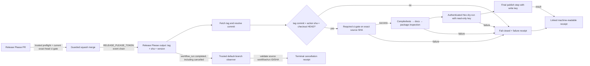

# Phase 248: Exact-Source Release Gate - Research

**Researched:** 2026-10-07
**Domain:** GitHub Actions release automation, immutable source provenance, Hex publishing, and durable evidence
**Confidence:** HIGH

DATA_c20b482f_START
<user_constraints>
## User Constraints (from CONTEXT.md)

### Locked Decisions

### Guarded release PR automation
- **D-01:** Add automatic squash-merge for the single valid Release Please PR after the release candidate preflight and required `ci-gate` both pass on the exact current head SHA. This removes the last manual merge transition before the existing release workflow.
- **D-02:** Run the privileged merge decision from trusted default-branch workflow code. Require the expected Release Please branch, `autorelease: pending` label, release title/base, exactly one open candidate, successful source CI run, successful `ci-gate` on its SHA, and the candidate-content preflight. Re-read PR state and head immediately before merging; merge with `--match-head-commit`. Never use `--admin`, bypass rules, or merge a stale head. GitHub branch protection remains authoritative.
- **D-03:** Use the already-configured `RELEASE_PLEASE_TOKEN` for the automated merge/event chain, with only the permissions needed to update/merge the release PR and trigger downstream workflows. Do not silently fall back to `GITHUB_TOKEN` for the merge: GitHub suppresses normal push-triggered workflows for events caused by that token. If token scope or event-chain behavior is insufficient, fail closed with an actionable run link and leave the PR open.

### Exact source and package validation
- **D-04:** Treat Release Please `tag_name` and `sha` as one provenance pair. Before package work, fetch/resolve the tag and require the resolved commit, checked-out `HEAD`, and Release Please `sha` to be identical. Version/tag/manifest string agreement remains a useful secondary check, not a substitute for commit identity.
- **D-05:** Keep verification stages in the existing trusted release lane: required CI gate, tests, warning-free docs, package inspection, authenticated Hex dry-run, then publish. Each stage must consume the same immutable tag/SHA; any mismatch or failed stage blocks publication. Do not create a speculative `v1.6.0` tag to test the lane.
- **D-06:** Use a dedicated read-only Hex credential for the authenticated dry-run (`HEX_DRY_RUN_API_KEY`) and reserve the existing write-capable `HEX_API_KEY` for the final publish step. Configure the read-only key once as a GitHub Actions environment secret in the main-restricted `hex-publish` environment; no per-release local authentication or operator command is part of the happy path. `mix hex.publish --dry-run --yes` still authenticates, but it does not submit the release to Hex. Prove the no-publish recovery path through the existing `hex-publish.yml` `dry_run: true` route, dispatching the workflow definition from `main` and validating the package's separate immutable source ref; the real 1.6.0 lane must dry-run its exact tag before it publishes.

### Run safety and receipts
- **D-07:** A later main push must not cancel an active release evaluation. Use non-cancelling release concurrency and make any replacement/retry idempotent by release identity. A newer event must not erase the only pending release result.
- **D-08:** Retain linked, machine-readable stage receipts keyed by release run ID and carrying version, tag, source SHA, workflow/run identity and URLs, gate run, verdict, attempts, timestamps, and publish result. Preserve receipts for success and failure; add a trusted default-branch completion observer so manual or infrastructure cancellation still yields a terminal cancellation record. The observer must validate the source workflow/run and must not execute PR-branch code or trust unvalidated artifacts.
- **D-09:** Receipts are the primary durable proof. Human-facing failure issues/labels are supplementary and must never suppress or replace the machine-readable receipt. Keep the existing failure notification useful, but make the release result discoverable even if a GitHub label is missing.

### Candidate content and folded todos
- **D-10:** The auto-merge preflight must reject release notes left under `## Unreleased`, duplicate release-note entries, or a versioned changelog that omits source-backed adopter changes. Fix the current PR #224 candidate before the auto-merge lane may select it.
- **D-11:** Fold `.planning/todos/pending/2026-07-28-release-please-orphans-unreleased-block.md` into the candidate-content gate. Automatic merging removes the human review moment that previously caught stranded notes, so the durable guard belongs in this phase.
- **D-12:** Fold `.planning/todos/pending/2026-07-28-release-lane-rot-label-missing-breaks-hard-02-signal.md` into receipt/failure reporting. A missing label must not make release failure appear successful or erase its durable diagnostics.
- **D-13:** The `gate-ci-green` timeout todo is reviewed but not folded as new work: the current workflow already uses a 120-attempt, 30-second poll budget and a 75-minute job timeout. Keep that ceiling covered by the release contract.

### the agent's Discretion
- Choose workflow/script boundaries, exact JSON property names, artifact retention, and deterministic fixture shape while preserving the decisions above.
- Prefer same-workflow `needs` for release state transitions. Use `workflow_run` only where its completion semantics are needed for cancellation receipts; correlate explicitly to the source run ID/SHA and run trusted default-branch code.
- Use the narrowest job permissions, keep third-party actions pinned, and avoid a new release framework or broad CI redesign.
- Keep the operator experience centered on one automatic path with a linked run and receipt; do not expose token, tag, or package internals as user-facing product concepts.

### Deferred Ideas (OUT OF SCOPE)
- Broad CI restructuring, adopting a generic multi-repository release platform, and redesigning release automation beyond this repository's existing Release Please/Hex path.
- Hex resolver ranking / retired-version cleanup and unrelated pending CI or generated-auth work.
- Phase 249's public package, HexDocs, protected-main, and clean-worktree proof.

### Reviewed Todos (not folded)
- `.planning/todos/pending/2026-07-28-gate-ci-green-timeout-too-tight-for-push-to-main.md` — already mitigated by the current 120 × 30-second poll and 75-minute job timeout; retain regression coverage without reopening the old fix.
- `.planning/todos/pending/2026-07-03-hex-retire-stray-1-20-0.md` — Hex version-ranking cleanup is outside the selected 1.6.0 release gate.
- `.planning/todos/pending/2026-07-30-recapture-job-transient-hexpm-mirror-failure.md` — unrelated transient recapture lane.
- Other `todo.match-phase 248` matches were lexical false positives from generic CI/source/gate terms and remain outside scope.
</user_constraints>
DATA_c20b482f_END

<phase_requirements>
## Phase Requirements

| ID | Description | Research Support |
|----|-------------|------------------|
| AUTO-01 | Before release package work starts, the release tag is proven to resolve to the exact Release Please source SHA whose required CI gate passed; the existing test, warning-free docs, package-content, and Hex dry-run checks run against that immutable source. Active release evaluation is not cancelled, workflow permissions are scoped, and the Hex secret is available only to the final publish step. [VERIFIED: `.planning/REQUIREMENTS.md:27`; verbatim quote: `DATA_8e9b21ca_START Before release package work starts, the release tag is proven to resolve to the exact Release Please source SHA whose required CI gate passed; the existing test, warning-free docs, package-content, and Hex dry-run checks run against that immutable source. Active release evaluation is not cancelled, workflow permissions are scoped, and the Hex secret is available only to the final publish step. DATA_8e9b21ca_END`] | Exact tag resolution; exact head CI identity; CI → compile/tests → docs → package inspection → read-key dry-run → publish dependencies; concurrency and secret scope findings below. |
| AUTO-02 | The release lane retains machine-readable gate and publish receipts for both success and failure, linking version/tag, source SHA, workflow/run identity, verdict, relevant URLs, attempts/timestamps, and failure or cancellation state. [VERIFIED: `.planning/REQUIREMENTS.md:28`; verbatim quote: `DATA_30de9a17_START The release lane retains machine-readable gate and publish receipts for both success and failure, linking version/tag, source SHA, workflow/run identity, verdict, relevant URLs, attempts/timestamps, and failure or cancellation state. DATA_30de9a17_END`] | Stage receipt schema, `always()` failure path, trusted `workflow_run` cancellation observer, and deterministic fixtures below. |
</phase_requirements>

## Project Constraints (from AGENTS.md)

- Automation-first verification applies within this authorized phase: prefer deterministic tests, CI polling, and committed machine-readable evidence; never waive or report missing evidence as passed; keep work inside Phase 248 scope. [VERIFIED: `AGENTS.md:12-17`; exact source excerpt: `DATA_b7c93e44_START Within explicitly authorized work, replace human verification and UAT with deterministic tests, browser automation, CI polling, and committed machine-readable evidence. Retry transient failures once and automatically diagnose and repair deterministic failures. Never waive, auto-approve, or mark missing evidence as passed; block with durable diagnostics when a requirement cannot be proven automatically. Do not use automation-first verification as authority to start unrelated phases or expand product scope. DATA_b7c93e44_END`]
- Keep the existing third-party action pinning convention and scope write permissions to the specific jobs that need them; the phase context also locks pinned actions and least-privilege permissions. [VERIFIED: `248-CONTEXT.md:38-42`; exact decision: `DATA_31a7bc69_START Use the narrowest job permissions, keep third-party actions pinned, and avoid a new release framework or broad CI redesign. DATA_31a7bc69_END`]
- Respect GitHub API limits during future live checks: one watcher per run, use the repository’s 60-second compact watch command, check `gh api rate_limit` before long polling, and stop on 403/429 until reset. [VERIFIED: `AGENTS.md:41-47`; exact excerpt: `DATA_e1769a42_START Use at most one CI watcher per workflow run. Never use the three-second gh run watch default; use gh run watch <run-id> --repo szTheory/sigra --compact --interval 60 --exit-status. Do not poll the same run from multiple agents. Reuse the active watcher's result. After a run completes, fetch its structured summary once. Fetch failed logs only when the conclusion is a failure. Before a long watch, inspect gh api rate_limit. If the REST core budget has 250 or fewer requests remaining, make no further CI polling requests until its reported reset time. Treat HTTP 403 or 429 rate-limit responses as a hard stop until GitHub's reported reset or retry time; do not retry them immediately. DATA_e1769a42_END`]
- Admin UI brand/theme and Playwright conventions do not apply because this phase has no user-facing UI. [VERIFIED: `AGENTS.md:3-10`; phase boundary at `248-CONTEXT.md:3-11`]

## Summary

Phase 248 extends the existing Release Please → `ci-gate` → Hex lane. Release Please already publishes `release_created`, `tag_name`, `version`, and `sha`; its official action describes `sha` as the commit to which the GitHub Release was tagged. The current workflow waits for `ci-gate`, checks out the tag, tests, builds docs, inspects the Hex package, dry-runs and publishes, but it does not compare the tag-resolved commit or checkout `HEAD` to Release Please `sha`. [VERIFIED: `.github/workflows/release-please.yml:33-37,147-150`; verbatim values: “release_created”, “tag_name”, “version”, “sha”] [CITED: https://github.com/googleapis/release-please-action#outputs]

Build the change around the existing workflow and script seams: add a trusted-default-branch guarded auto-merge/preflight; make the release workflow enforce one SHA across CI, tests, docs, package inspection, dry-run, and publish; write machine-readable stage receipts; and add a trusted completion observer for cancellation. Reuse the existing poller and manual dry-run recovery workflow. Add no release framework or package dependency. GitHub `workflow_run` is useful for terminal cancellation observation, but the event’s own `GITHUB_SHA` is the default-branch commit, not the original workflow run SHA; use its `workflow_run` payload and query the original run by ID. [CITED: https://docs.github.com/en/actions/reference/workflows-and-actions/events-that-trigger-workflows#workflow_run]

The Phase 247 dependency is an execution/evidence prerequisite, not a reason to defer planning: `init.plan-phase 248` reports Phase 248 pending with complete context and no plans. The project state says Phase 247 source selection is still blocked on Phase 246’s required CI evidence, and the roadmap says Phase 248 depends on Phase 247. Plan for Phase 247’s finalized candidate and source receipt as inputs; do not use the current checkout or stale PR snapshot as the release source. [VERIFIED: `init.plan-phase 248`; `.planning/STATE.md:33-36,89-93`; `.planning/ROADMAP.md:88-95`; verbatim values: “Pending”, “Phase 246 completion”, “Phase 247 Plan 01 Task 2 source selection is blocked”, “**Depends on**: Phase 247”]

**Primary recommendation:** Extend `.github/workflows/release-please.yml` and its testable script seams, with one trusted auto-merge workflow and one narrowly scoped `workflow_run` cancellation observer; compare the tag commit, checkout HEAD, Release Please SHA, and CI gate SHA before any package command, and make all receipt writes independent of the human issue-label notifier. [VERIFIED: `.planning/phases/248-exact-source-release-gate/248-CONTEXT.md:17-30,64-82`; verbatim values include “RELEASE_PLEASE_TOKEN”, “HEX_DRY_RUN_API_KEY”, “HEX_API_KEY”, “ci-gate”, “workflow_run”]

## Architectural Responsibility Map

| Capability | Primary Tier | Secondary Tier | Rationale |
|------------|-------------|----------------|-----------|
| Release candidate validation and protected squash merge | GitHub Actions control plane | GitHub PR/Checks API | Trusted default-branch workflow evaluates candidate metadata, latest CI state, and candidate content, then re-reads head and merges with an exact-head precondition. [VERIFIED: `248-CONTEXT.md:17-20`; quoted values: “RELEASE_PLEASE_TOKEN”, “autorelease: pending”, “--match-head-commit”] |
| Tag/SHA/CI identity and package checks | GitHub Actions release runner | Git and Hex API | The release runner is the only tier that can compare checkout `HEAD` with resolved tag and action output before running checks and publish. [VERIFIED: `release-please.yml:96-126,128-254`; quoted values: “gate-ci-green”, “publish-hex”, `ref: ${{ needs.release-please.outputs.tag_name }}`, `mix hex.publish --dry-run --yes`] |
| Durable stage and cancellation evidence | GitHub Actions artifacts and trusted observer | GitHub Actions API | Source jobs persist normal success/failure evidence; a default-branch completion observer records terminal cancellation when source jobs cannot finish their own receipt step. [CITED: GitHub workflow_run docs; VERIFICATION: context D-08] |
| Hex write authority | Final publish step | Hex API | Dry-run receives the approved read-only credential; only the final publish step receives write-capable `HEX_API_KEY`. [VERIFIED: `248-CONTEXT.md:24-25`; verbatim values: “HEX_DRY_RUN_API_KEY”, “HEX_API_KEY”] |

## Standard Stack

### Core

| Library or seam | Version | Purpose | Why standard |
|-----------------|---------|---------|--------------|
| GitHub Actions workflow and `gh`/GitHub API | Existing workflows; local `gh` 2.101.0 observed | Orchestrate CI, guarded merge, release checks, receipts, and cancellation observation. | The phase is defined around the repository’s existing Actions release lane and GitHub branch protections. [VERIFIED: `release-please.yml:11-37`; `AGENTS.md:43-47`; local `gh --version`] |
| Release Please action | Existing pinned action `v5.0.0` | Produce tag, version, release-created flag, and release source SHA. | Already owns manifest/changelog/version release transitions; its official docs define the root `sha` output. [VERIFIED: `release-please.yml:85-94`; quote: `googleapis/release-please-action@45996ed1f6d02564a971a2fa1b5860e934307cf7 # v5.0.0`; CITED: https://github.com/googleapis/release-please-action#outputs] |
| Existing CI workflow and `scripts/ci/wait-for-ci-gate.sh` | Current poll budget is 120 attempts × 30 seconds; release job timeout 75 minutes | Prove required CI success and expose it to hermetic tests. | Existing script supports SHA-scoped `gh run list`, checks the `ci-gate` job, and has a `--from-json` fixture seam. Preserve the currently reviewed timeout budget. [VERIFIED: `release-please.yml:96-126`; `wait-for-ci-gate.sh:40-46,103-108,140-162`; verbatim values: “ci-gate”, “--from-json”, “verdict: \"PASS\"”] |
| Mix/Hex tasks | Project’s locked toolchain from `.tool-versions` | Compile/tests, warning-free docs, package unpack inspection, authenticated non-publishing preflight, final publish. | These are already the release lane’s real package tasks; Hex documents dry-run as local package checks without publication and `hex.build --unpack` as the content-inspection path. [VERIFIED: `release-please.yml:164-254`; CITED: https://hex.hexdocs.pm/Mix.Tasks.Hex.Publish.html] |

### Supporting

| Tool or seam | Purpose | When to use |
|--------------|---------|-------------|
| `actionlint` 1.7.12 | Static validation of changed workflow YAML and expressions. | Run on changed workflow files; available locally in this environment. [VERIFIED: local `actionlint --version`] |
| Bash + JSON fixture tests | Deterministic policy tests for SHA mismatch, missing/failed CI, duplicate candidates, malformed receipts, failures, cancellation, and retries. | Extend `scripts/ci/wait-for-ci-gate.test.sh` conventions; it stubs `gh` and controls JSON inputs. [VERIFIED: `scripts/ci/wait-for-ci-gate.test.sh:1-40,121-132,251-295`] |
| Existing recovery workflow | Manual source-bound dry-run or explicitly requested recovery publish. | Keep its `dry_run` branch read-only; verify dry-run path never reaches the publish step. [VERIFIED: `.github/workflows/hex-publish.yml:20-24,150-182`; quote: “dry_run”, “HEX_API_KEY”, “mix hex.publish --dry-run --yes”] |
| Existing post-publish evidence script | Public version and HexDocs/source-link receipt model. | Reuse its machine-readable fields as precedent; extend/reconcile rather than inventing unrelated semantics. [VERIFIED: `scripts/ci/release-post-publish-verify.sh:86-100`; quoted values: “status”, “version”, “tag”, “verified_at”] |

**Installation:** No external package installation is required. The phase changes workflow YAML, Bash/JavaScript validation scripts, and deterministic tests. [VERIFIED: Phase 248 context scope; `.planning/config.json`; workflows/scripts inspected this session]

## Architecture Patterns

### System Architecture Diagram



The observer must use the original source run’s fields; the observer’s own default-branch `GITHUB_SHA` identifies its workflow code, while GitHub’s `workflow_run` payload supplies the source-run context. The completion trigger fires regardless of source conclusion, and the observer itself has access to secrets and write tokens, so gate by source workflow identity and never execute PR code. [CITED: https://docs.github.com/en/actions/reference/workflows-and-actions/events-that-trigger-workflows#workflow_run]

### Recommended Project Structure

Reuse `.github/workflows/release-please.yml`, `.github/workflows/hex-publish.yml`, `.github/workflows/ci.yml`, `scripts/ci/wait-for-ci-gate.sh`, `scripts/ci/wait-for-ci-gate.test.sh`, `scripts/ci/release-post-publish-verify.sh`, and `scripts/ci/notify-failure-issue.sh`. Their exact names are quoted in the source context. [VERIFIED: `248-CONTEXT.md:64-70`; exact quoted paths appear there]

Recommended new workflow/script/test paths are delegated choices and have not been created yet: place the guarded candidate merge/preflight workflow beside `release-please.yml`, the cancellation observer beside it, and focused receipt/preflight helpers and fixture tests under `scripts/ci/`. [ASSUMED: path recommendation; risk if wrong is a planner file-map adjustment, not a release contract change]

### Pattern 1: Guard candidate merge from trusted code

**What:** Trigger from a trusted default-branch workflow after source CI completes, identify exactly one open candidate, validate branch/title/base/label and candidate-content conditions, verify required check state against candidate head, then re-query PR state/head immediately before `gh pr merge --squash --match-head-commit <verified-sha>`. [VERIFIED: `248-CONTEXT.md:17-20`; quoted values: “autorelease: pending”, “--match-head-commit”, “Never use `--admin`”]

**When to use:** Before any automatic Release Please PR merge. [VERIFIED: Context D-01 and D-02]

GitHub Actions `pull_request` runs test the synthetic PR merge commit, and `GITHUB_SHA` is that merge commit; `github.event.pull_request.head.sha` is the branch head. Therefore the phase’s exact-head requirement cannot be inferred from a green PR check bubble alone. The planner should explicitly select/prove a CI run whose check conclusion is attached to the exact PR head SHA; if using a dispatch, verify its resulting run SHA equals the captured candidate head and fail closed on a branch-advance race. [CITED: https://docs.github.com/en/actions/reference/workflows-and-actions/events-that-trigger-workflows#pull_request]

**Prior art:** `lattice_stripe` checks candidate head equality, check runs on the targeted SHA, re-reads state/head just before merge, and uses `--match-head-commit`; reuse the invariant only, not its branch names or token choices. [VERIFIED: `/Users/jon/projects/lattice_stripe/.github/workflows/release-pr-automerge.yml:79-105,115-149,179-220`; verbatim values: “ci-gate”, “--match-head-commit”]

### Pattern 2: Establish immutable tag/checkout/source identity

**What:** Before package work, fetch tags, resolve `tag^{commit}`, record `git rev-parse HEAD`, compare both to Release Please output `sha`, and stop before dependencies/build/tests if any value differs. Keep version/tag/manifest checks as secondary checks. [VERIFIED: `248-CONTEXT.md:22-25`; quoted command “git rev-parse” is an implementation recommendation [ASSUMED]; RELEASE Please output keys verbatim at `release-please.yml:33-37`]

**When to use:** At the beginning of the release package job and before any stage can influence publish eligibility. [VERIFIED: REQUIREMENTS.md:27]

The existing `publish-hex` job checks out `tag_name`, while the action separately exposes `sha`; this is the precise gap to close. Resolve annotated tags to commits (`^{commit}`), compare full object IDs, and pass one verified immutable commit/ref to each stage. [VERIFIED: `release-please.yml:33-37,147-150`; quoted values: `ref: ${{ needs.release-please.outputs.tag_name }}`, “sha”]

### Pattern 3: Keep release outcome independent from notification

**What:** Build a stage receipt after every terminal gate/publish result, upload it even after ordinary failures using an unconditional step/job, and let a separate trusted completion observer write the cancellation receipt if the release run cannot execute its receipt step. Retain the current issue notifier only as supplemental UX. [VERIFIED: `248-CONTEXT.md:27-30`; `release-please.yml:283-321`; quoted value: `if: always()`]

**When to use:** For every created release and each stage that changes the publish verdict. [VERIFIED: AUTO-02 at `.planning/REQUIREMENTS.md:28`]

Include release version/tag/source SHA, release workflow run ID and URL, stage workflow/job/run URLs, verdict, CI gate run ID/URL, attempts, start/end UTC timestamps, failure step/reason, publish result, and a source-run ID link on the observer cancellation record. Property spellings and retention duration are delegated, so make them stable and validate them in tests. [ASSUMED: suggested receipt shape; user constraints require these concepts but not exact property names]

### Pattern 4: Scope credentials and make retries safe

**What:** Set read-only workflow defaults, add only per-job permissions actually required, keep the merge token in the protected merge job, give `HEX_DRY_RUN_API_KEY` only to the dry-run step, and expose `HEX_API_KEY` only to the final publish step. Keep third-party actions SHA-pinned. [VERIFIED: Context D-03/D-06 and agent discretion; repo conventions in `.github/workflows/release-please.yml:19-23,88-94,244-254`; quoted values: “actions: write”, “contents: write”, “issues: write”, “pull-requests: write”, “HEX_API_KEY”]

**Concurrency caution:** `cancel-in-progress: false` avoids canceling a running job, but by itself does not preserve multiple queued runs: GitHub’s default concurrency group allows one pending run and replaces an earlier pending run with a later one. Use unique event/run groups for independent evaluations or `queue: max` with idempotency keyed by release identity; do not group unrelated main pushes into one lossy queue. [CITED: https://docs.github.com/en/actions/how-tos/write-workflows/choose-when-workflows-run/control-workflow-concurrency]

**Token caution:** GitHub suppresses most new workflow runs caused by `GITHUB_TOKEN`; a GitHub App installation token or PAT can trigger the event chain. The user decision locks the existing `RELEASE_PLEASE_TOKEN` and forbids silently falling back for merge. Keep its permission scope limited to the release PR operations and downstream workflow event need. [CITED: https://docs.github.com/en/actions/how-tos/write-workflows/choose-when-workflows-run/trigger-a-workflow]

### Anti-Patterns to Avoid

- Treating matching version strings as proof of source identity; different commits can contain the same version metadata. Require resolved tag commit = Release Please `sha` = checked-out `HEAD`. [VERIFIED: Context D-04; quoted values: “tag_name”, “sha”, “HEAD”]
- Reading a successful `pull_request` check as exact-head proof without inspecting the check run SHA; the workflow tests a synthetic merge commit by default. [CITED: GitHub pull_request event documentation]
- Assuming `cancel-in-progress: false` retains all release events; the default single pending slot is replaceable. [CITED: GitHub concurrency documentation]
- Putting the write Hex key into the whole publish job or dry-run step, or treating a read-only authenticated dry-run as proof that the publish key has write permission. [VERIFIED: Context D-06; CITED: Hex source and key permissions docs]
- Relying on `if: always()` in the source workflow for manual/force cancellation; hard cancellation can prevent that workflow from writing its own terminal receipt. [CITED: https://docs.github.com/en/rest/actions/workflow-runs#force-cancel-a-workflow-run; VERIFIED: Context D-08]
- Making issue labels/issues the evidence source. The receipt must be uploaded before/independently of label or issue operations. [VERIFIED: Context D-09/D-12; `notify-failure-issue.sh:20-28`]
- Trusting `workflow_run` artifacts or checking out and executing PR-branch scripts in the privileged observer. Validate source workflow ID/name, run ID, repository, and source SHA from GitHub API; treat artifacts as untrusted data. [CITED: GitHub workflow_run security guidance]
- Using a stale PR head or bypassing branch protection to keep the chain moving. [VERIFIED: Context D-02; quoted values: “Never use `--admin`”, “--match-head-commit”]

## Don't Hand-Roll

| Problem | Don't Build | Use Instead | Why |
|---------|-------------|-------------|-----|
| Required check execution and aggregation | A second CI matrix or reimplementation of required lanes | Existing `ci.yml` `ci-gate` and `wait-for-ci-gate.sh` seam, extended to assert exact run SHA | `ci-gate` aggregates the required jobs and the shell poller already queries runs by commit and their named gate. [VERIFIED: `ci.yml:1571-1673`; `wait-for-ci-gate.sh:103-108,140-162`; quoted value: “ci-gate”] |
| Release version/tag generation | Custom tag/version generator | Existing Release Please action outputs | It is the approved release mechanism and already exposes all identity fields. [VERIFIED: Context D-01/D-04 and `release-please.yml:33-37`; quoted values: “tag_name”, “version”, “sha”] |
| Hex package/docs archive validation | Custom tarball builder or docs packager | `mix hex.build --unpack`, `mix docs --warnings-as-errors`, and `mix hex.publish --dry-run --yes` | Official Hex tasks build/check the actual package contents; dry-run performs local checks without publishing. [CITED: https://hex.hexdocs.pm/Mix.Tasks.Hex.Publish.html] |
| Workflow syntax and static safety | Ad hoc YAML checks | `actionlint` plus focused structural contract tests | Existing project already uses workflow-contract and prohibition tests, and `actionlint` is installed locally. [VERIFIED: local `actionlint --version`; `scripts/ci/prohibitions/p04-no-release-lane-cancellation.test.mjs`; `phase_222_release_lane_hardening_test.exs`] |

**Key insight:** Release safety is a chain of identity proofs and fail-closed transitions, not a version-string check. The release SHA must remain the common key from Release Please output through required CI, all local package checks, the publish step, and each linked receipt. [VERIFIED: Context D-04/D-05/D-08]

## Common Pitfalls

### Pitfall 1: CI passed on the wrong commit identity

**What goes wrong:** The PR merge commit or a later branch tip is mistaken for the exact Release Please candidate SHA. **Why it happens:** GitHub’s default pull-request workflow tests the synthetic merge commit. **How to avoid:** Query check runs by the candidate head SHA and require the required gate conclusion at that exact SHA; if dispatching CI, compare the run’s reported SHA to the candidate before accepting it. **Warning signs:** `workflow_run.head_sha`, PR `headRefOid`, and CI check `head_sha` differ. [CITED: GitHub pull_request docs; VERIFICATION: Context D-01/D-02]

### Pitfall 2: Tag points elsewhere or checkout defaults to a mutable ref

**What goes wrong:** A tag is moved or checkout resolves a different object than the tested SHA. **Why it happens:** Existing checkout uses the tag output but never asserts its resolved commit equals action `sha`. **How to avoid:** Resolve tag to commit and compare all three identities before package setup; then run checks against the verified commit object. **Warning signs:** only manifest/version/tag text is compared. [VERIFIED: `release-please.yml:147-150,179-206`; Context D-04]

### Pitfall 3: A new event replaces pending release evidence

**What goes wrong:** Active source run remains, but a later event replaces its only pending run or cancels it. **Why it happens:** Concurrency groups default to one pending slot; current release workflow has `cancel-in-progress: true`. **How to avoid:** remove the canceling shared release group and choose unique run identity or a bounded queue plus release-identity idempotency. Preserve retry receipts and link superseded attempts. **Warning signs:** two main pushes share one concurrency key. [VERIFIED: `release-please.yml:25-27`; CITED: GitHub concurrency docs; Context D-07]

### Pitfall 4: Cancellation/failure has no receipt

**What goes wrong:** A failure is visible only in Actions UI or a label-dependent issue; manual/force cancellation yields no JSON terminal record. **Why it happens:** downstream `always()` and issue reporter do not cover hard cancellation or label failure. **How to avoid:** source-run receipt for normal failure and independent default-branch completion observer for cancellation; upload/retain JSON and link the observer receipt to the original run. **Warning signs:** artifact upload has `if-no-files-found: ignore`, issue notifier is the only consumer, or observer uses the observer's SHA as release SHA. [VERIFIED: `release-please.yml:283-321`; `notify-failure-issue.sh:20-28`; CITED: workflow_run and force-cancel docs]

### Pitfall 5: Hex dry-run and publish credentials have overlapping scope

**What goes wrong:** Write authority is exposed during preflight, or the team assumes read-only dry-run tests write permission. **Why it happens:** current workflow sets `HEX_API_KEY` in both steps; Hex dry-run authenticates with `Hex.API.User.me` but skips release/docs upload calls. **How to avoid:** use the approved separate read-scoped key only on dry-run, final write key only on publish, and prove each step’s environment contract structurally. The read key proves authentication; final write-key availability and actual publish authorization are verified only in the final step. [VERIFIED: `release-please.yml:244-254`; Context D-06; CITED: Hex source https://raw.githubusercontent.com/hexpm/hex/v2.5.1/lib/mix/tasks/hex.publish.ex and key permissions https://hex-core.hexdocs.pm/hex_api_key.html]

### Pitfall 6: Candidate preflight is green on stale or incomplete PR content

**What goes wrong:** Auto-merge publishes an unreconciled changelog with notes stranded under `Unreleased`, duplicates, or missing source-backed adopter changes. **Why it happens:** auto-merge removes the human review step that caught these defects. **How to avoid:** make the PR-content gate read the exact current head version of `CHANGELOG.md`, require one version section with no matching candidate material left in `Unreleased`, detect duplicate entries, and compare required content to the Phase 247 source-backed readiness artifact. Re-read head before merge. [VERIFIED: Context D-10/D-11; `.planning/phases/247-release-candidate-and-repository-readiness/247-CONTEXT.md` D-01/D-03]

## Code Examples

### Exact-source assertion (recommended shell shape)

```bash
set -euo pipefail
git fetch --force --tags origin
tag_commit="$(git rev-parse "${TAG_NAME}^{commit}")"
head_commit="$(git rev-parse HEAD)"
if [[ "$tag_commit" != "$RELEASE_SHA" || "$head_commit" != "$RELEASE_SHA" ]]; then
  echo "tag/checkout does not match Release Please source SHA" >&2
  exit 1
fi
```

This is a recommended testable shape, not current repository code. The governing values are quoted verbatim from the locked decision: `tag_name`, `sha`, and `HEAD`. [VERIFIED: `248-CONTEXT.md:22-24`; ASSUMED: exact shell implementation]

### Receipt validation shape

Keep schema decisions in the phase tests. Require non-empty source identity, workflow and run URLs, timestamp ordering, a known terminal verdict, and stage-specific fields; reject malformed JSON and never turn absent gate data into success. Existing wait-poller JSON currently emits `sha`, `run_url`, `attempts`, and `verdict: "PASS"`; extend this contract rather than silently changing consumers. [VERIFIED: `wait-for-ci-gate.sh:158-166`; verbatim values: “sha”, “run_url”, “attempts”, “verdict: \"PASS\"”]

## Validation Architecture

`workflow.nyquist_validation` is enabled in `.planning/config.json`, so phase-specific validation architecture belongs in the plan. [VERIFIED: `.planning/config.json`; quoted value: `"nyquist_validation": true`]

### Test Framework

| Property | Value |
|----------|-------|
| Framework | Bash hermetic tests and ExUnit workflow-contract tests; Node `node:test` also used for CI policy tests. |
| Config file | `mix.exs` ExUnit setup; workflow tests are under `test/sigra/planning/` and `scripts/ci/`. |
| Quick run command | `bash scripts/ci/wait-for-ci-gate.test.sh` plus focused new receipt/preflight tests. |
| Full suite command | `mix test` and `actionlint .github/workflows/release-please.yml .github/workflows/hex-publish.yml <new-workflows>`; run exact `mix ci`/required CI gate before execution is considered complete. |

Existing `phase_222_release_lane_hardening_test.exs` checks YAML structure and notifier semantics; `wait-for-ci-gate.test.sh` stubs GitHub CLI and covers green, timeout, dispatch, empty/malformed payloads, and JSON mode. [VERIFIED: `test/sigra/planning/phase_222_release_lane_hardening_test.exs:22-76`; `scripts/ci/wait-for-ci-gate.test.sh:133-295`]

### Phase Requirements → Test Map

| Req ID | Behavior | Test Type | Automated Command | File Exists? |
|--------|----------|-----------|-------------------|-------------|
| AUTO-01 | Reject wrong tag commit, wrong checkout HEAD, wrong Release Please SHA, missing/failed gate, and any package stage before a matching gate; assert Hex write secret occurs only in publish step. | Shell unit + workflow contract + live CI run evidence | Focused helper tests; `actionlint`; live CI gate on candidate SHA before package steps | New exact-source tests needed; poller test exists. |
| AUTO-02 | Emit linked receipts for success and each failure; validate observer emits cancellation for a matching source run and rejects unrelated workflow/run/artifact data. | JSON schema/fixture tests + live observer contract | Focused receipt and workflow fixture tests; Actions API read-only probe for source-run IDs/conclusions | New receipt/observer tests needed; post-publish evidence helper exists. |
| AUTO-merge gate | Only one valid Release Please PR with candidate preflight + exact-head CI can merge; stale head and branch-protection rejection leave PR open. | Unit fixtures + integration probe | Candidate-script tests; live read-only check discovery; merge attempt only via authorized workflow | New tests/workflow needed. |

### Sampling Rate

- Per script change: run that script’s hermetic fixture test.
- Per workflow change: run `actionlint` and focused workflow contract tests.
- Before treating phase as verified: run full required `ci-gate` and preserve machine-readable receipts; no human UAT is needed for these criteria. [VERIFIED: `AGENTS.md:12-17`; quoted directives: “deterministic tests”, “committed machine-readable evidence”, “Never waive”]

### Wave 0 Gaps

- Add fixture-driven tests for exact `tag^{commit}` = Release Please SHA = checkout HEAD, and prove package commands remain downstream of gate success.
- Add candidate-preflight fixtures for stranded `Unreleased`, duplicate changelog entries, missing source-backed adopter notes, wrong candidate branch/title/base/label, and multiple open candidates.
- Add receipt tests for success, stage failures, malformed/missing identifiers, duplicate retry/event idempotency, and cancelled source run.
- Add actionlint/workflow contracts for job-level permissions and secret placement, non-cancelling/replacement-safe concurrency, `workflow_run` source validation, and pinned action refs.

## Security Domain

Security enforcement is enabled by default; this phase has release supply-chain and credential boundaries, not application authentication flows. [VERIFIED: `.planning/config.json`; quoted value: workflow has no `security_enforcement: false` setting]

### Applicable ASVS Categories

Use the current ASVS 5.0 chapter numbering. GitHub Actions secret handling is an operational supply-chain boundary, so apply ASVS controls by concern and keep app-auth/session sections marked not applicable. [CITED: https://owasp.org/projects/asvs; current chapter names: https://github.com/OWASP/ASVS/tree/master/5.0/en]

| ASVS 5.0 Category | Applies | Standard Control |
|-------------------|---------|-----------------|
| V2 Validation and Business Logic | Yes | Validate PR identity/content, workflow event fields, source run identity, tag and SHA relationships, and receipt JSON before using them in decisions. [CITED: https://github.com/OWASP/ASVS/blob/master/5.0/en/0x11-V2-Validation-and-Business-Logic.md] |
| V4 API and Web Service | Yes | Restrict GitHub API calls to the intended repository/run/PR; treat API results as input and fail closed when required fields are missing. [CITED: https://github.com/OWASP/ASVS/tree/master/5.0/en] |
| V6 Authentication | No app auth flow | No end-user authentication changes; operational tokens are handled under least privilege and secret protection. [CITED: https://github.com/OWASP/ASVS/blob/master/5.0/en/0x15-V6-Authentication.md] |
| V7 Session Management | No | No application session behavior changes. [CITED: https://github.com/OWASP/ASVS/tree/master/5.0/en] |
| V8 Authorization | Yes | Apply least-privilege workflow/job permissions, keep branch protection authoritative, and give Hex write permission only to the final publish step. [CITED: https://github.com/OWASP/ASVS/blob/master/5.0/en/0x17-V8-Authorization.md] |
| V11 Cryptography | No custom crypto | Do not add custom signatures or cryptography; use Git object IDs for identity and existing platform secret/token mechanisms. [CITED: https://github.com/OWASP/ASVS/tree/master/5.0/en] |
| V13 Configuration | Yes | Keep workflow permissions, action pins, concurrency, and secret placement explicit and reviewed. [CITED: https://github.com/OWASP/ASVS/tree/master/5.0/en] |
| V16 Security Logging and Error Handling | Yes | Preserve terminal success/failure/cancellation receipts with timestamps, URLs, attempts, and failure reasons; do not allow notifier failure to suppress evidence. [CITED: https://github.com/OWASP/ASVS/tree/master/5.0/en] |

### Known Threat Patterns for GitHub Actions / Hex Release

| Pattern | STRIDE | Standard Mitigation |
|---------|--------|---------------------|
| Tag/SHA substitution or stale candidate race | Spoofing/Tampering | Resolve tag to commit; compare full commit ID to Release Please `sha` and checkout `HEAD`; re-read PR head immediately before guarded merge. |
| Malicious PR workflow/code reaches privileged observer | Elevation of privilege | Observer runs trusted default-branch code; do not execute candidate code, do not use unvalidated artifact fields; query source run by ID and validate repo/workflow/SHA. [CITED: GitHub workflow_run security guidance] |
| Broad PAT or Hex write key leaks to preflight | Elevation of privilege | Narrow job permissions; restrict RELEASE_PLEASE_TOKEN to merge/event chain; read-only dry-run key in a single step; write Hex key in final publish step only. |
| New event cancels or overwrites in-flight result | Denial of service | Non-cancelling per-run evaluation; use queue semantics that do not replace needed pending evidence; idempotent retries by release identity; cancellation observer. |
| Missing label/API response is misreported as success | Repudiation | Make JSON receipts the primary proof; fail closed on absent/malformed source records; notifier remains supplemental. |

## Environment Availability

| Dependency | Required By | Available | Version | Fallback |
|------------|-------------|-----------|---------|----------|
| GitHub Actions and repository APIs | Merge, CI, receipts, completion observer | ✓ remotely configured | — | None; plan against GitHub Actions. |
| `gh` | Local contract/probe work and existing CI poller | ✓ | 2.101.0 | GitHub REST API with scoped token. |
| Git / Bash / jq | Exact object identity and existing shell helpers | ✓ | Git 2.41.0; Bash 5.2.37; jq 1.7.1 | Runner-provided equivalents. |
| Mix / Hex | Package checks and dry-run | ✓ locally; Actions runner uses `.tool-versions` | Erlang/OTP 28 reported locally; use repository toolchain in CI | Existing manual `hex-publish.yml` dry-run-only route for recovery. |
| `actionlint` | Workflow syntax validation | ✓ | 1.7.12 | CI tool install only if execution runner lacks it. |
| `HEX_DRY_RUN_API_KEY` | Authenticated non-publishing dry-run | Not observable locally; secret contents were not read | — | Configure approved read-only secret in the main-restricted `hex-publish` Actions environment; missing secret must block dry-run and publish. |
| `HEX_API_KEY` | Final publish only | Configured in GitHub per phase context; secret contents not read | — | No fallback; missing write credential fails final publish and retains failure receipt. |
| `RELEASE_PLEASE_TOKEN` | Guarded merge/event chain | Configured per phase context; secret contents not read | — | No `GITHUB_TOKEN` merge fallback; fail closed with run link if permissions/event chain fail. |

No dependency installation is needed. Do not read or print secret values during planning or execution. [VERIFIED: phase context D-03/D-06 and code-context lines 88-100; secrets were not read]

## Assumptions Log

| # | Claim | Section | Risk if Wrong |
|---|-------|---------|---------------|
| A1 | Add a separate trusted auto-merge workflow and cancellation observer, with helpers/tests under `scripts/ci/`. | Architecture Patterns | Planner may choose to keep some logic in existing workflow; file-map adjustment only. |
| A2 | A CI workflow dispatch at the current release PR branch can produce a run whose SHA is the exact current head; race handling must confirm returned SHA before accepting. | Pattern 1 / Open Questions | If dispatch behavior or branch workflow semantics differ, exact-head check needs a different trusted-run mechanism. |
| A3 | GitHub Actions artifact retention plus a linked observer artifact satisfies the phase’s durable receipt horizon; exact retention is left to planning. | Pattern 3 | If Phase 249 requires committed or longer-lived records, receipt persistence design must change before implementation. |
| A4 | The read-only Hex API key is accepted by Hex authentication during dry-run but cannot prove write authorization; actual publish step remains the only write permission proof. | Pitfall 5 | If Hex changes auth semantics or key scope, authenticated dry-run may fail and require a new documented procedure; user decision remains locked pending evidence. |

## Resolved Planning Questions

1. **Exact-head CI source — RESOLVED for planning.** Add a `push` trigger for the sole Release Please branch (`release-please--branches--main`) to the existing CI workflow. A push run is bound to the pushed commit; the trusted `workflow_run` consumer must still query the source run and require its `head_sha`, the current PR head, and successful `ci-gate` identity to agree immediately before merge. This preserves exact-head semantics without accepting the synthetic `pull_request` merge SHA. During execution, prove the live run reports the expected head SHA; absence or mismatch blocks merge automation. [CITED: GitHub `push`, `pull_request`, and `workflow_run` event docs; `.github/workflows/ci.yml` current trigger at lines 11-35; `248-CONTEXT.md` D-01/D-02]
2. **Receipt store/retention — RESOLVED for this phase.** Retain linked JSON receipts as GitHub Actions artifacts for 90 days, matching the existing release-evidence artifact policy. This covers Phase 249's near-term verification and keeps evidence independent from labels/issues; longer-term archival or external storage is deferred because it would add a new service and broader retention policy outside this phase. Verify artifact download/linkability in execution. [VERIFIED: `release-please.yml:283-290`; `.planning/phases/248-exact-source-release-gate/248-CONTEXT.md:27-30,104-107`; verbatim value: `retention-days: 90`]
3. **Read-only Hex key setup — RESOLVED for planning.** Configure `HEX_DRY_RUN_API_KEY` once as a GitHub Actions environment secret in the `hex-publish` environment, alongside the write-capable `HEX_API_KEY`; keep `RELEASE_PLEASE_TOKEN` in the separate `release-automation` environment. Both environments use an exact `main` deployment-branch policy, and recovery dispatches the workflow definition from `main` while passing the package tag/SHA as separate source input. This refines D-06's approved one-time GitHub Actions secret setup to close the modified-workflow-ref secret exposure found by plan review. Automation may check secret presence by boolean only and prove authenticated dry-run behavior but must never read or print values. Missing configuration/authentication blocks the live release path and remains visible in diagnostics. [VERIFIED: D-06; plan-checker iteration 2 finding; GitHub environment/deployment policy docs; secret contents were not read]

## Sources

### Primary (HIGH confidence)

- `.planning/phases/248-exact-source-release-gate/248-CONTEXT.md` — locked release automation, source identity, secret boundaries, receipts, content preflight, and scope.
- `.planning/REQUIREMENTS.md`, `.planning/ROADMAP.md`, `.planning/STATE.md` — AUTO-01/AUTO-02, dependency, and current Phase 246/247 evidence status.
- `.github/workflows/release-please.yml`, `.github/workflows/hex-publish.yml`, `.github/workflows/ci.yml` — existing release, recovery, and required CI seams.
- `scripts/ci/wait-for-ci-gate.sh`, `scripts/ci/wait-for-ci-gate.test.sh`, `scripts/ci/release-post-publish-verify.sh`, `scripts/ci/notify-failure-issue.sh` — existing polling, fixtures, evidence, and notification behavior.
- `test/sigra/planning/phase_222_release_lane_hardening_test.exs`, `scripts/ci/prohibitions/p04-no-release-lane-cancellation.test.mjs` — structural contract/prohibition patterns.

### Official documentation (MEDIUM confidence)

- [GitHub Actions events: `pull_request` and `workflow_run`](https://docs.github.com/en/actions/reference/workflows-and-actions/events-that-trigger-workflows) — synthetic merge SHA semantics, default-branch completion observer, source run context, and security warning.
- [Triggering workflows and `GITHUB_TOKEN`](https://docs.github.com/en/actions/how-tos/write-workflows/choose-when-workflows-run/trigger-a-workflow) — workflow suppression and PAT/GitHub App event-trigger behavior.
- [GitHub Actions concurrency](https://docs.github.com/en/actions/how-tos/write-workflows/choose-when-workflows-run/control-workflow-concurrency) — running/pending replacement and `queue: max` behavior.
- [Release Please action outputs](https://github.com/googleapis/release-please-action#outputs) — `tag_name`, `version`, `release_created`, and `sha` outputs.
- [Hex `mix hex.publish`](https://hex.hexdocs.pm/Mix.Tasks.Hex.Publish.html) and [Hex v2.5.1 publish-task source](https://raw.githubusercontent.com/hexpm/hex/v2.5.1/lib/mix/tasks/hex.publish.ex) — authenticated user lookup, dry-run no-upload boundary, and package/doc checks.
- [Hex API key permissions](https://hex-core.hexdocs.pm/hex_api_key.html) — read/write resource permission model.
- [GitHub force-cancel workflow-run API](https://docs.github.com/en/rest/actions/workflow-runs#force-cancel-a-workflow-run) — force cancellation may bypass `always()` paths.
- [OWASP ASVS 5.0.0](https://owasp.org/projects/asvs) and [official chapter index](https://github.com/OWASP/ASVS/tree/master/5.0/en) — current validation, authorization, configuration, and logging categories used to scope this workflow/security phase.

## Metadata

**Confidence breakdown:**
- Standard stack: HIGH — all primary workflow and helper seams were opened locally; no new package is recommended.
- Architecture: HIGH — locked phase decisions plus GitHub and Hex primary documentation support the proposed flow; exact PR-head CI run mechanism remains an explicit planning question.
- Pitfalls: HIGH — current workflow gaps are visible in source; cancellation, PR merge SHA, token suppression, and Hex dry-run behavior are documented by upstream primary sources.

**Research date:** 2026-10-07
**Valid until:** Recheck before execution because GitHub Actions event/concurrency semantics, Release Please outputs, and configured secrets can change.
