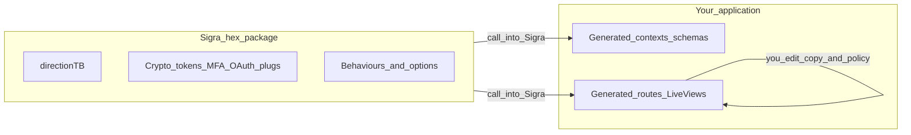
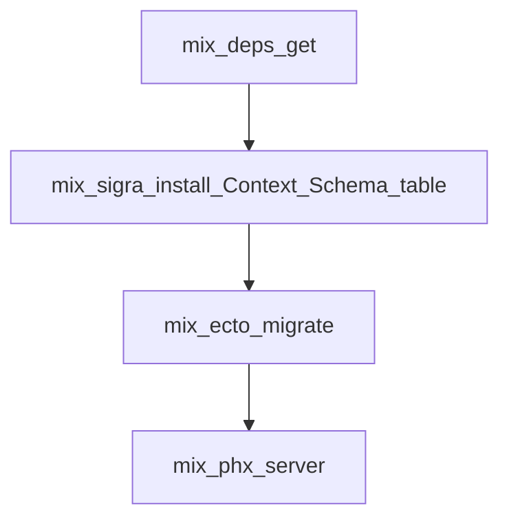

# Sigra

[](https://hex.pm/packages/sigra)
[](https://hexdocs.pm/sigra)
[](https://github.com/szTheory/sigra/actions/workflows/ci.yml)

**Production-minded authentication for Phoenix 1.8+** — sessions, passwords, email flows, OAuth, MFA, passkeys, optional organizations and admin tooling — without treating security-sensitive code as throwaway scaffolding.

**TL;DR**

- **Problem:** Pow does not support Phoenix 1.8+. Rolling your own auth across crypto, sessions, MFA, and OAuth is slow and risky.
- **What Sigra is:** A **library** of hardened primitives plus **generators** that emit normal Phoenix modules into *your* repo — you patch UX and policy; you `mix deps.update` the sensitive core.
- **When to leave:** You want a hosted identity product (Auth0-as-app) or a framework that hides all auth code from the repo entirely — different tradeoffs.

---

## Pick your lane

| You are… | Do this first |
|----------|----------------|
| **Evaluating** | Skim **Where code lives** (diagram), **What ships**, then open [HexDocs](https://hexdocs.pm/sigra) for API depth. |
| **Integrating** | Run **First integration** (diagram + commands), read **Prerequisites** and the [Sigra 1.0 contract](guides/introduction/contract.md), then follow [Installation](guides/introduction/installation.md) and [Getting started](guides/introduction/getting-started.md). |
| **Contributing** | Match [toolchain pins in `.tool-versions`](https://github.com/sztheory/sigra/blob/main/.tool-versions), run Postgres-backed tests per [`CLAUDE.md` in the repo](https://github.com/sztheory/sigra/blob/main/CLAUDE.md), read [`CONTRIBUTING.md`](CONTRIBUTING.md); use the [reference example app](https://github.com/sztheory/sigra/tree/main/test/example) as the integration host. |
| **Maintaining / releasing** | See [`MAINTAINING.md`](MAINTAINING.md) for version bumps, Hex and GitHub releases, and planning hygiene for maintainers. |

## Before production

Public HTTPS hosts need aligned origins, proxy-forwarded TLS, session cookies, and a deliberate mail-delivery posture before you take real traffic. Treat the deployment recipe as the single checklist hub — skim it once per environment.

- **[Production checklist (read first)](guides/recipes/deployment.md#production-checklist-read-first)** — scheme, cookies, LiveView origins, staging parity.
- **[Mail: inline vs Oban (TL;DR)](guides/recipes/deployment.md#mail-delivery-inline-vs-oban-tl-dr)** — when background delivery is worth the operational cost.

**Milestone planning (maintainers):** Product north star and scope boundaries for GSD live in `.planning/PROJECT.md` under **North Star (milestones)** (with **Core Value** and **Out of Scope**).

---

## Where code lives



- **Left:** ships on Hex; security fixes ride **`mix deps.update`**.
- **Right:** plain Elixir under `lib/my_app/` and `lib/my_app_web/` — code review and product iteration happen there.

---

## First integration



1. **Dependency** (`mix.exs`):

   ```elixir
   {:sigra, "~> 1.0"}
   ```

   This is the selected 1.0 contract line. If Hex package metadata advertises a newer installable line, treat Hex as the current package truth and use the version constraint appropriate for your target. For version, stack, ownership, and non-goal boundaries, read the [Sigra 1.0 contract](guides/introduction/contract.md).

2. **Scaffold** (from app root; names must match your domain):

   ```bash
   mix deps.get
   mix sigra.install Accounts User users
   ```

3. **Database + run**:

   ```bash
   mix ecto.migrate
   mix phx.server
   ```

Branching installer flags (`--no-live`, `--admin`, `--api`, …) are summarized below; **every switch and default** is documented in source (`lib/mix/tasks/`) and, when published, on [HexDocs](https://hexdocs.pm/sigra) alongside the API reference.

---

## Prerequisites

| Requirement | Notes |
|-------------|--------|
| **Elixir** | `~> 1.18` (see [`mix.exs`](mix.exs)); align local toolchains with [`.tool-versions` on GitHub](https://github.com/sztheory/sigra/blob/main/.tool-versions). |
| **Phoenix** | 1.8.x baseline the library targets. |
| **Database** | Ecto + typical Postgres setup for the happy path; other adapters are handled in generated migrations where applicable. |
| **Mailer** | Email flows expect Swoosh (or compatible) wiring — see [Installation](guides/introduction/installation.md). |

---

## Installer at a glance

| Intent | Example flags | Read more |
|--------|----------------|-----------|
| **Controllers only** (no LiveView UI) | `--no-live` | [`mix sigra.install` source](lib/mix/tasks/sigra.install.ex), [HexDocs](https://hexdocs.pm/sigra) |
| **API / JWT surface** | `--api`, or `--jwt` (implies API pieces) | [API authentication](guides/flows/api-authentication.md), [`sigra.install` source](lib/mix/tasks/sigra.install.ex) |
| **Admin LiveView suite** | default on; **`--no-admin`** to omit | [`sigra.install` source](lib/mix/tasks/sigra.install.ex) |
| **Passkeys** | default on; **`--no-passkeys`** to omit | [Passkeys recipe](guides/recipes/passkeys.md) |
| **Organizations** | default on; **`--no-organizations`** to omit | [Multi-tenant recipe](guides/recipes/multi-tenant.md) |
| **UUID primary keys** | default on; **`--no-binary-id`** for bigint IDs | [`sigra.install` source](lib/mix/tasks/sigra.install.ex) |
| **OAuth slice only** (existing install) | `mix sigra.gen.oauth …` | [OAuth flow](guides/flows/oauth.md), [`sigra.gen.oauth` source](lib/mix/tasks/sigra.gen.oauth.ex) |

---

## What ships in the box

One clause each — depth lives in HexDocs and the guides linked in the next section.

| Area | You get |
|------|---------|
| **Identity** | Argon2id passwords, optional bcrypt → Argon2id upgrade on login, remember-me, sudo / step-up hooks. |
| **Sessions** | Database-backed sessions, device/IP metadata hooks, revocation patterns the generators wire up. |
| **Email** | Registration, confirmation (link + code), magic link, reset, lifecycle mailers — Swoosh-shaped templates in the host. |
| **MFA** | TOTP (NimbleTOTP), backup codes, lockout-aware verification; trust-this-device patterns in the example app. |
| **OAuth** | Assent-backed strategies, encrypted token fields when Cloak is in play; optional `mix sigra.gen.oauth` for incremental adoption. |
| **Passkeys** | WebAuthn via `wax_` when enabled — registration + authentication ceremonies with host-owned credential rows. |
| **Organizations** | Logical multi-tenancy (memberships, invitations, scoped plugs) when enabled — not “separate DB per tenant”. |
| **Admin** | Optional installer-generated admin LiveView (global + org lenses), impersonation guardrails, audit surfaces when enabled. |
| **Audit** | Structured audit logging hooks feeding explorer/export flows where the installer emitted them. |

---

## Topic map → guides

| Topic | Guide |
|-------|--------|
| Installation & env | [introduction/installation.md](guides/introduction/installation.md) |
| First happy path | [introduction/getting-started.md](guides/introduction/getting-started.md) |
| Companion library suite | [introduction/suite-integration.md](guides/introduction/suite-integration.md) |
| Upgrade notes | [pre-1.0 -> v1.0](guides/introduction/upgrading-to-v1.0.md) · [v1.0 → v1.1](guides/introduction/upgrading-to-v1.1.md) · [toward v1.7](guides/introduction/upgrading-to-v1.7.md) · [toward v1.8](guides/introduction/upgrading-to-v1.8.md) |
| Migration lanes | [from phx.gen.auth](guides/introduction/migrating-from-phx-gen-auth.md) · [from Pow/Guardian/Ueberauth](guides/introduction/migrating-from-pow-guardian-ueberauth.md) |
| Registration | [flows/registration.md](guides/flows/registration.md) |
| Login / logout | [flows/login-and-logout.md](guides/flows/login-and-logout.md) |
| Password reset | [flows/password-reset.md](guides/flows/password-reset.md) |
| Account lifecycle | [flows/account-lifecycle.md](guides/flows/account-lifecycle.md) |
| OAuth | [flows/oauth.md](guides/flows/oauth.md) |
| MFA | [flows/mfa.md](guides/flows/mfa.md) |
| API / JWT | [flows/api-authentication.md](guides/flows/api-authentication.md) |
| Audit logging | [flows/audit-logging.md](guides/flows/audit-logging.md), [audit semantics](docs/audit-semantics.md) |
| Deployment | [recipes/deployment.md](guides/recipes/deployment.md) |
| Testing | [recipes/testing.md](guides/recipes/testing.md) |
| Passkeys | [recipes/passkeys.md](guides/recipes/passkeys.md) |
| Multi-tenant patterns | [recipes/multi-tenant.md](guides/recipes/multi-tenant.md) |
| Custom user fields | [recipes/custom-user-fields.md](guides/recipes/custom-user-fields.md) |
| Subdomain auth | [recipes/subdomain-auth.md](guides/recipes/subdomain-auth.md) |

---

## Security posture (headlines)

| Topic | Default stance |
|-------|----------------|
| **Passwords** | Argon2id via configured hasher; bcrypt verify-and-upgrade path when enabled. |
| **Tokens** | HMAC-protected, time-bounded patterns for magic links, reset, confirmation — stored references, not “guessable IDs only”. |
| **Enumeration** | Safer defaults on account discovery flows (details in HexDocs per flow). |
| **Step-up** | Sudo / MFA challenge patterns integrate with Phoenix plugs and LiveView mounts as generated. |

For threat-model detail and per-flow guarantees, use **HexDocs**, [SECURITY.md](SECURITY.md), and the [Sigra 1.0 contract](guides/introduction/contract.md) for the full invariants and non-goals — the README stays a map, not a spec.

## Release evidence (maintainers and auditors)

Sigra keeps an **evidence hub** (what we ran versus waived for GA cuts, how CI maps to human UAT rows, and pointers to planning artifacts on GitHub). That material is **not** a compliance certificate for your application — integration and deployment risk stay with the **host**.

- **[GA evidence and audit posture](docs/ga-evidence.md)** — router page; same content ships on [HexDocs](https://hexdocs.pm/sigra/ga-evidence.html).
- **[UAT versus CI coverage](docs/uat-ci-coverage.md)** — machine versus human boundaries.

Coordinated disclosure: [SECURITY.md](SECURITY.md).

---

## Reference host: `test/example`

The [`test/example`](https://github.com/sztheory/sigra/tree/main/test/example) tree is a **real Phoenix app** living inside this repo: it tracks what `mix sigra.install` (and friends) emit, compiles under `--warnings-as-errors` in CI, and backs **Playwright** browser smoke (golden path, org flows, admin checkpoints, GA shift-left specs). It is not a second product — it is the executable contract that installer drift tests and reviewer artifacts refer to. When in doubt about “what does the generator actually produce?”, read that tree or the HexDocs task reference.

---

## Contributing & issues

- **Workflow & CI** — [`CONTRIBUTING.md`](CONTRIBUTING.md) (Playwright artifacts, installer audit jobs, Pages mirror).
- **Local parity** — [`CLAUDE.md` on GitHub](https://github.com/sztheory/sigra/blob/main/CLAUDE.md) (Postgres one-liner, `mix test` expectations).
- **Bugs & ideas** — [GitHub Issues](https://github.com/szTheory/sigra/issues).

---

## License

MIT — see [`LICENSE`](LICENSE).
