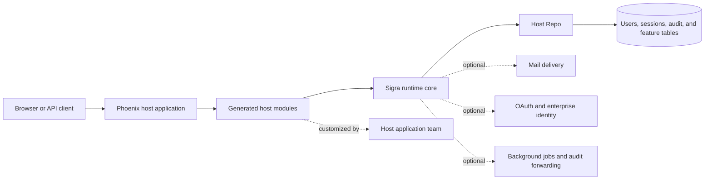
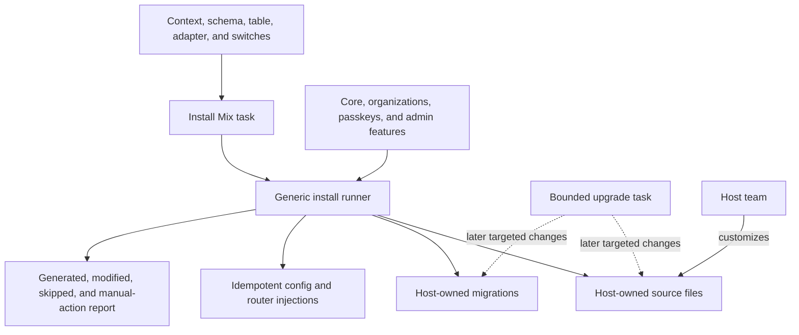
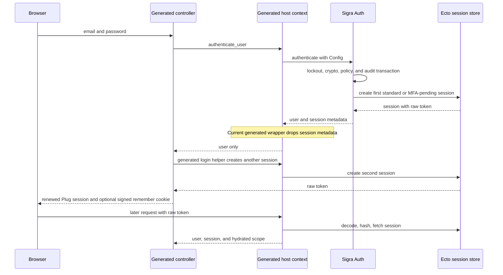
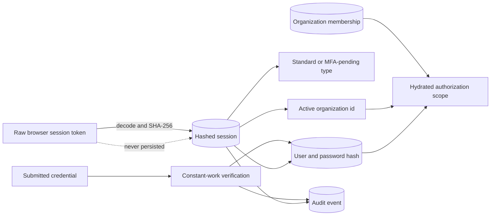

# Sigra architecture

## The boundary that makes Sigra work

Sigra is deliberately two things at once: a dependency that keeps security-critical
behavior updateable, and a generator that gives a Phoenix application visible code
to own. Once that boundary is clear, the repository stops looking like a collection
of auth features and starts looking like a small set of journeys through two owners.

Use this guide to decide **where a change belongs**. Use the companion
[code walkthrough](code-walkthrough.html) when you want to follow representative
values through the implementation.

## Sigra in one picture



The solid path is the normal request path. The dotted edges are integration choices,
not hidden services owned by Sigra.

## Vocabulary for the trip

- **Generated host** means the schemas, context functions, controllers, plugs,
  LiveViews, routes, migrations, and configuration emitted into the adopting Phoenix
  application. The host team owns and may customize those files.
- **Runtime core** means the installed Sigra dependency: password verification,
  lockout policy, token primitives, sessions, MFA, auditing, and other generic
  operations that can receive security fixes through a dependency update.
- **Reference host** means Sigra's runnable example application. It proves how the
  integration behaves, but its generated modules and names are not public API.
- **Session** means a durable server-side record whose database key is a SHA-256
  hash. The browser receives only the corresponding Base64url raw token.
- **Scope** means the request identity and authorization context assembled by the
  host: user, active organization, membership-derived facts, and impersonation state.
- **Audit co-fate** means a business change and its audit insertion succeed or roll
  back in the same caller-owned `Ecto.Multi`. It applies only where the operation
  explicitly composes that Multi.
- **Optional integration** means a capability guarded at runtime or boot—such as
  Oban, Hammer, Assent, Joken, EQRCode, or Threadline—whose absence has an explicit
  feature-specific behavior.

The ownership boundary is carried into runtime calls as data. A `%Sigra.Config{}`
names the host modules that generic operations may call:

```elixir
Sigra.Config.new!(
  repo: MyApp.Repo,
  user_schema: MyApp.Accounts.User,
  scope_module: MyApp.Accounts.Scope,
  organizations_module: MyApp.Organizations,
  session: [
    store: Sigra.SessionStores.Ecto,
    session_schema: MyApp.Accounts.UserSession
  ],
  audit: [audit_schema: MyApp.Accounts.AuditEvent]
)
```

This is dependency inversion in practical Phoenix terms: Sigra owns algorithms and
orchestration; the host supplies persistence and application-specific callbacks.

## Journey 1: Installation creates an ownership boundary

`mix sigra.install` parses host-specific names and feature switches, builds one
binding, and hands a feature list to `Sigra.Install.Runner.run/3`. The runner knows
how to walk features; feature modules know what to render and inject.



The runner filters with each feature's `enabled?/1`, allocates migration timestamps,
overlays timestamps from matching migrations already on disk, skips existing files,
and applies injections idempotently. That is why rerunning installation does not mean
regenerating a host's customized auth layer.

```elixir
active = Enum.filter(features, fn feature -> feature.enabled?(opts) end)
allocated = Sigra.Install.MigrationTimestamps.allocate(active, base_time)

report =
  Enum.reduce(active, Sigra.Install.Report.new(), fn feature, report ->
    feature_binding = Keyword.put(binding, :migration_timestamps, timestamps[feature] || %{})

    report
    |> run_files(feature, feature_binding)
    |> run_injections(feature, feature_binding)
    |> run_post_instructions(feature, feature_binding)
  end)
```

After generation, ownership divides cleanly:

- Change a form, route, schema field, or host policy seam in the generated host.
- Change a cryptographic primitive or generic auth invariant in the runtime core.
- Add a generator capability in a feature module while preserving runner
  idempotency and generated-host expectations.
- Use `mix sigra.upgrade` for the bounded artifacts it advertises. A dependency
  update changes runtime code; neither operation silently overwrites arbitrary host
  customization.

For the operational path, see [Installation](installation.html),
[Generator options](generator-options.html), and [Upgrading](upgrading-to-v1.12.html).

## Journey 2: A login becomes durable identity and session state

Password login crosses the ownership boundary twice. The generated controller and
context translate HTTP input into a typed `Sigra.Auth.authenticate/3` result. The
runtime normalizes the email, loads the host user, checks lockout **before** password
verification, takes a constant-work verification path for an unknown user, applies
enterprise policy, and co-transacts successful lockout/hash work with its configured
audit insertion.



The double session shown above is **current implementation drift**, not a desired
contract. `Sigra.Auth.authenticate/3` returns session metadata, but the current
generated `authenticate_user/2` collapses that result to `{:ok, user}`. The generated
`UserAuth.log_in_user/3` then creates the token it actually places in Plug. This guide
records the behavior so maintainers do not reason from an idealized path; it does not
bless or repair the seam.

The durable token split is intentional:

```elixir
raw = :crypto.strong_rand_bytes(32)
hashed = :crypto.hash(:sha256, raw)

browser_token = Base.url_encode64(raw, padding: false)
database_token = hashed
```

On a later request, the generated host Base64url-decodes the browser token, hashes
the decoded bytes, and asks the configured session store for the matching row. It
then loads the user and hydrates the host scope. The canonical table for these
records is `auth.user_sessions`; older flow documentation that describes session
rows as `auth.user_tokens` is stale and should not be used as evidence for this path.

## Security is the architecture

Security is not an extra layer around the journey. It determines which values may
cross each boundary and which state transitions may become durable.



The main invariants are concrete:

- Lockout is checked before expensive password work. Unknown users still take the
  password verification path, and public failures remain enumeration-safe.
- Raw session tokens stay at the transport boundary. The database stores only their
  hashes, and Plug session renewal clears the old session before writing a new token.
- A session type can be `:mfa_pending`; completing MFA replaces it with a session
  appropriate for authenticated use rather than mutating browser trust implicitly.
- Active organization and membership are authorization context. Login-time
  organization selection may fail open to keep login available, while request scope
  hydration decides what identity context the host will authorize.
- Audit atomicity is operation-specific. For example, a successful login can compose
  reset/hash work and audit insertion into one Multi:

```elixir
multi =
  Ecto.Multi.new()
  |> Ecto.Multi.run(:login_repo_work, reset_and_upgrade)
  |> Sigra.Audit.log_multi_safe("auth.login.success", audit_opts)

case repo.transact(multi) do
  {:ok, changes} -> Sigra.Audit.emit_telemetry_from_changes(changes)
  {:error, step, reason, changes} -> {:error, step, reason, changes}
end
```

Telemetry is emitted only after commit. Standalone failure audits preserve evidence
for failed attempts, but they cannot honestly share fate with business state that was
never committed.

## Cross-cutting mechanics

### Configuration and callbacks

`Sigra.Config.new!/1` validates the host Repo, schemas, scope and organization
modules, mail modules, policy callbacks, and feature settings. Passing the struct
explicitly keeps generic runtime code testable and allows more than one configuration
to exist in a VM.

### Optional dependencies

Optional does not mean “silently equivalent.” Each boundary has deliberate behavior:

- `:auto` mail delivery and audit forwarding use Oban only when it is both loaded and
  supervised, otherwise they run synchronously. Explicit async configuration without
  supervised Oban fails actionably.
- An absent or unconfigured Hammer limiter is a warned no-op. Assent- or Joken-backed
  feature calls fail with setup instructions. Missing EQRCode yields no QR rendering.
- Threadline forwarding is optional. Passkeys configured with a plaintext stub vault
  fail at boot instead of silently weakening at-rest protection.

### Supervision and boot work

`Sigra.Application` performs one-shot diagnostics, audit-forwarder attachment, and
vault validation, then starts an empty supervisor. Sigra does not own long-lived
workers; Oban, mailers, repositories, and other processes belong to the host.

```elixir
def start(_type, _args) do
  maybe_warn_audit_cleanup_fallback()
  maybe_warn_missing_cookie_domain()
  maybe_warn_missing_forwarder_deps()
  attach_forwarders()
  verify_vault!()

  Supervisor.start_link([], strategy: :one_for_one, name: Sigra.Supervisor)
end
```

### Observability

Telemetry spans mark authentication, session creation, delivery, and other operations.
Committed audit rows emit `[:sigra, :audit, :log]`, which optional forwarders may
consume. The durable row remains the source of truth; forwarding is a downstream
effect.

## Module atlas

| Question | Start here | Continue into |
| --- | --- | --- |
| What does installation own? | `Mix.Tasks.Sigra.Install` | `Sigra.Install.Runner`, `Sigra.Install.Feature`, feature modules |
| How does host configuration enter the runtime? | `Sigra.Config` | the generated host context's `sigra_config/0` |
| How is a password evaluated? | `Sigra.Auth.authenticate/3` | `Sigra.Lockout`, `Sigra.Crypto`, `Sigra.EnterpriseAuthPolicy` |
| Where do browser sessions live? | `Sigra.Auth.create_session/4` | `Sigra.SessionStores.Ecto`, `Sigra.Token`, generated `UserAuth` |
| How does request identity gain organization context? | `Sigra.Scope` | `Sigra.Scope.Hydration`, `Sigra.Organizations` |
| How does audit state share a transaction? | `Sigra.Audit.log_multi_safe/3` | the caller's Multi and `Sigra.Audit.emit_telemetry_from_changes/2` |
| What happens when an integration is absent? | `Sigra.OptionalDeps` | `Sigra.Delivery`, `Sigra.Audit.Forwarders`, feature-specific caller |
| What happens at application boot? | `Sigra.Application` | diagnostics, forwarder attachment, vault validation |

For generated code, inspect the modules in your own application. For runtime code,
the module page's **View Source** link is the stable way into the implementation.

## Code-reading routes

Choose a route based on the question you are answering:

1. **Installation ownership:** `Mix.Tasks.Sigra.Install` →
   `Sigra.Install.Runner` → one feature module. Ask where host-specific knowledge
   first appears and where idempotency is enforced.
2. **Password and session:** generated controller → generated context →
   `Sigra.Auth` → `Sigra.SessionStores.Ecto` → generated `UserAuth`. Ask which
   representation of the token exists at every hop.
3. **MFA:** `Sigra.Auth` → `Sigra.MFA` → session replacement. Ask which state is
   allowed while a session is `:mfa_pending`.
4. **OAuth and enterprise reconciliation:** `Sigra.OAuth.Callback` → identity and
   organization policy modules. Ask where an external identity becomes a local user.
5. **Audit forwarding:** a caller-owned Multi → `Sigra.Audit` →
   `Sigra.Audit.Forwarders`. Ask which effects are durable and which are downstream.

The [code walkthrough](code-walkthrough.html) follows the second route in detail and
touches the others where they cross it.

## Changing Sigra safely

Before editing, locate the owner and protect its boundary:

- A runtime security change needs direct unit or database-backed invariant tests and
  a compatibility check against the generated host seam.
- A generator change needs feature isolation, idempotency, syntax, and golden-output
  evidence. Existing generated files are host-owned, so test upgrade behavior
  separately from fresh installation.
- A host customization should continue delegating security-critical work to the
  runtime and preserve token, session-renewal, scope, and enumeration invariants.
- An optional integration change needs tests for loaded-and-supervised, loaded-only,
  and absent states. Compilation availability alone is not runtime readiness.
- An audit change must state whether insertion co-fates with business state and must
  keep forwarding telemetry after commit.

Treat the reference host as executable evidence, not an API promise. When its behavior
and an older guide disagree, inspect the runtime, generator, and tests together and
record the mismatch instead of choosing the most convenient story.

## Where to go next

- Read the [code walkthrough](code-walkthrough.html) for a source-level login journey.
- Follow [Getting started](getting-started.html) to put the generated boundary into a
  Phoenix application.
- Use [MFA](mfa.html), [OAuth](oauth.html), [Account lifecycle](account-lifecycle.html),
  and [Audit logging](audit-logging.html) for task-oriented feature work.
- Use [Testing](testing.html) and [Local development](local-development.html) when
  changing Sigra itself.
